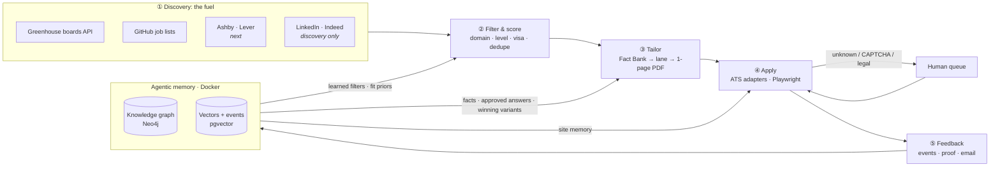
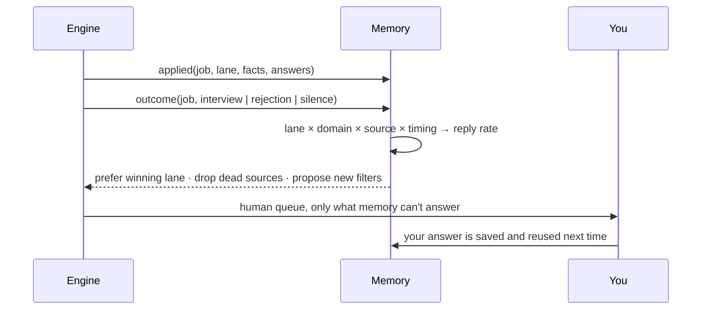

# REGEN · the job-hunting engine

> **The fuel for job hunting.** An open-source engine that finds jobs at the source, minutes after they go live, writes a truthful resume for each one, applies automatically within your domain, and learns from every outcome through an agentic memory that runs in Docker.

*REGEN is a working name. Branding comes later. The engine is what matters.*

[](#roadmap) [](LICENSE) [](pyproject.toml)

---

## What this is (and isn't)

**This isn't another auto-apply SaaS.** Tools like Jobright, LazyApply or Simplify Copilot are finished products: you use their UI, their filters and their pipeline, and your data lives on their servers.

**This is an engine.** It's the part underneath those products, open source and local-first, built to be embedded:

| Use it as… | How |
|---|---|
| **A project by itself** | Clone it, add your profile, and run `python -m engine scan → batch → apply`. |
| **A library** | `from engine.discovery.greenhouse import scan` and build your own app on top. |
| **A connector / plugin** *(v0.5)* | An MCP server, so Claude (Desktop or Code) or any agent can drive it in plain English, plus a REST API and webhooks for dashboards and other products. |

## Why it works

Most job seekers lose before they apply. A role is live on the company's own careers page for hours or days before it reaches LinkedIn, and by then hundreds of people are ahead. Auto-apply bots respond with volume: one generic resume sent 1,000 times through Easy Apply, until the account gets banned.

The engine makes the opposite bet:

| Principle | In practice |
|---|---|
| **Be early** | Poll company ATS boards (Greenhouse today; Ashby and Lever next) and machine-readable GitHub job lists directly. Apply at the source, not the mirror. |
| **Be specific** | Every job gets its own one-page resume, built from your **Fact Bank** and routed to the right **domain lane** (backend, platform, full-stack, AI…). |
| **Be honest** | The code can't invent a skill, number, employer or date. Legal answers (work authorization, sponsorship, EEO, arbitration) come only from your presets. |
| **Get smarter** | Every action and outcome becomes an event. The agentic memory turns events into a knowledge graph and refines what the engine does next. |

---

## Architecture



| Stage | Module | What it does |
|---|---|---|
| ① **Discovery** | `engine/discovery/` | Scans your list of Greenhouse boards in parallel (about 350 in seconds) plus the SimplifyJobs feed. Normalizes everything into one queue and tags each job's ATS. |
| ② **Filter** | `profile/domains.json` | Your domain as rules: titles, level, locations and sponsorship stance. Dedupes against every past application. |
| ③ **Tailor** | `engine/tailoring/` | Fetches the job description, routes it to a lane, builds a Fact-Bank-only resume, auto-fits it to one page, and flags questions that need you. |
| ④ **Apply** | `engine/apply/` | Fills ATS forms by DOM structure (no screenshot-and-click loops, about 10 s per form), submits only when every required answer is known, pauses for the Greenhouse email security code, and saves a full-page proof. |
| ⑤ **Feedback** | `engine/feedback/` | An append-only event log of every discovery, resume, application and outcome. This is the raw signal for learning. |
| **Memory** | `engine/memory/` + `deploy/` | Semantic memory (profile graph), episodic memory (jobs, applications, outcomes) and procedural memory (how each ATS works) in a local Neo4j + pgvector stack. |

The full design is in **[docs/ARCHITECTURE.md](docs/ARCHITECTURE.md)**. The original deep-dive design (sources, scoring funnel, outreach, costs) is in **[docs/PLAN.md](docs/PLAN.md)**.

### The feedback loop



The loop does three things. The human queue shrinks over time, because approved answers are reused. Resume lanes compete, and the one that gets replies wins. And the graph proposes new filters, such as "every job with a 2027 grad window has been a misfit, so exclude it."

---

## Scope

**In scope:**
- Automatic applications **within your domain**: discovery → filter → tailor → apply → verify.
- A **knowledge graph of your profile** (facts, skills, projects, preferences) in an agentic memory that runs in Docker.
- A **feedback loop** that refines filters, resume lanes and answers from real outcomes (confirmations, OAs, interviews, rejections).
- Being an **embeddable engine**: CLI, Python library, MCP server, REST API and webhooks, plugin packaging.
- Local-first by default. Your profile and history never leave your machine unless you connect a hosted store.

**Out of scope (by design):**
- Fabricating experience, or generating legal or attestation answers.
- Solving CAPTCHAs, or creating accounts on your behalf.
- Bot-applying on LinkedIn, Indeed or Handshake. Their terms forbid it, so they're used only for discovery and routing to the company's ATS.

---

## Status: v0.3 alpha

The first real run applied to **7 jobs** (Greenhouse + Ashby), each with its own tailored resume. Every Greenhouse submission cleared an email security code read from Gmail. Live state, known bugs and next fixes are in **[docs/HANDOFF.md](docs/HANDOFF.md)**.

| Capability | State |
|---|---|
| Greenhouse discovery + apply | ✅ working |
| SimplifyJobs feed | ✅ working |
| Fact-Bank tailoring + validator | ✅ working |
| Event log + `status` | ✅ working |
| Ashby apply | ⚠️ beta |
| Memory stack (Docker) | 🧱 stack defined, ingesters next |
| Gmail outcome loop | 🔜 |
| MCP / REST connectors | 🔜 |

---

## Quick start

```bash
git clone https://github.com/sameernagar-hub/regen-engine && cd regen-engine
pip install -r requirements.txt && playwright install chromium
cp -r profile.example profile           # fill in YOUR facts, presets, lanes, domains

python -m engine scan 3                 # fresh Greenhouse jobs (last 3 days) -> workspace/queue.json
python -m engine feed 7                 # SimplifyJobs new-grad feed -> workspace/feed_queue.json
python -m engine batch b1 <id>,<id>     # tailored resumes + workspace/batches/b1.json
python -m engine apply batches/b1.json --dry   # fill only; check workspace/proof/
python -m engine apply batches/b1.json         # fill + submit
python -m engine status                 # outcomes from the event log
```

Optional memory stack:

```bash
cp .env.example .env                    # set passwords
docker compose -f deploy/docker-compose.yml --env-file .env up -d
```

### Your profile (`profile/`, git-ignored)

| File | Purpose |
|---|---|
| `fact_bank.json` | The only source of resume content. Every bullet has an id and must be true. |
| `presets.json` | Standing answers: contact, location, work authorization, sponsorship, EEO, education. |
| `lanes.json` | Your domains as resume lanes (headline, summary, ordered fact ids) plus routing rules. |
| `domains.json` | Discovery filters: titles, locations, level. |

---

## Repository layout

```
regen-engine/
├── engine/                     the engine (Python package)
│   ├── __main__.py             CLI: scan · feed · batch · tailor · apply · status
│   ├── config.py               profile/ and workspace/ paths
│   ├── discovery/              ① fuel: Greenhouse boards, GitHub job feeds
│   ├── tailoring/              ③ Fact-Bank resume builder, lane router, batch builder
│   ├── apply/                  ④ Playwright ATS adapters + human queue
│   ├── feedback/               ⑤ append-only event log
│   ├── memory/                 agentic memory: graph schema, design (v0.4)
│   └── connectors/             MCP / REST / plugin (v0.5)
├── deploy/docker-compose.yml   memory stack: Neo4j + Postgres/pgvector
├── profile.example/            templates for your private profile/
├── workspace/                  runtime state (git-ignored): queue, resumes, proof, events
└── docs/
    ├── ARCHITECTURE.md         system design
    ├── PLAN.md                 original deep-dive design
    └── HANDOFF.md              current state, known bugs, how to resume
```

---

## Roadmap

| Release | Theme | Deliverables |
|---|---|---|
| **v0.1–0.3** ✅ | **Engine core** | Greenhouse + GitHub-feed discovery · Fact-Bank tailoring with validator · Greenhouse/Ashby apply with proof and human queue · email-code pause · event log · CLI + package |
| **v0.4** | **Agentic memory** | Ingest the profile and events into Neo4j + pgvector · facts-for-JD retrieval · approved-answer memory · procedural site memory |
| **v0.5** | **Connectors** | MCP server (`discover_jobs`, `tailor_resume`, `apply`, `queue_status`, `memory_query`, `engine_control`) · REST + webhooks · Claude Code plugin |
| **v0.6** | **Feedback loop** | Gmail reader (security codes + outcome classification) · lane and timing bandits · learned filters proposed by the graph |
| **v0.7** | **Coverage** | Ashby hardening · Lever · Workday and iCIMS (you create the account, the engine fills) · Ashby/Lever discovery |
| **v0.8** | **Always on** | Scheduler (every 15 min) · LLM fit scoring · dashboard (pipeline, human queue, response rates) |
| **v1.0** | **First public release** | Stable APIs · one-command setup · docs site · branding |

Beyond v1: recruiter and hiring-manager outreach, interview-prep packets from the job's graph neighborhood, and multi-profile support.

---

## Guardrails

1. **No fabrication**: `resume.validate()` rejects anything not in the Fact Bank.
2. **No improvised legal answers**: they come from presets only. Unknown answers go to the human queue.
3. **No CAPTCHA bypassing and no bot-created accounts.**
4. **Discovery-only on LinkedIn, Indeed and Handshake.**
5. **Your data stays yours**: `profile/` and `workspace/` are git-ignored and local by default.

## Contributing

Issues and PRs are welcome, especially ATS adapters (Lever, Workday, iCIMS), discovery sources, and memory ingesters. Never commit real profile data. Use `profile.example/` for fixtures.

## License

[MIT](LICENSE)
