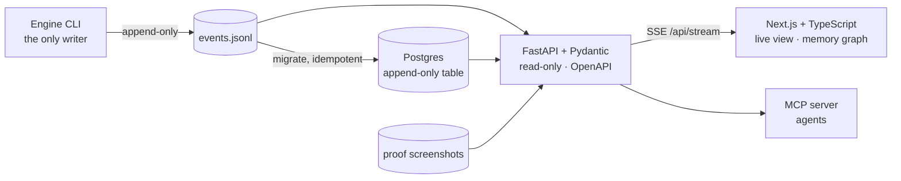
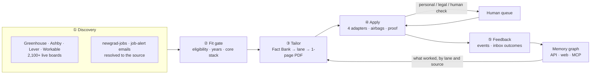

<div align="center">

# REGEN

### An open-source job engine that finds roles minutes after they're posted, writes a resume for each one from facts you can prove, applies at the company's own site, and shows you the evidence.

[](https://github.com/sameernagar-hub/regen-engine/actions/workflows/ci.yml)
[](LICENSE)
[](pyproject.toml)
[](apps/web)
[](apps/api)
[](engine/connectors/mcp_server.py)
[](SECURITY.md)


<sub>The live view replaying real activity, company names hidden. Each gold bead is an application with a saved confirmation page, grouped by the resume lane that wrote it.</sub>

**[Live demo](https://sameernagar-hub.github.io/regen-engine/)** · **[In plain English](#in-plain-english)** · **[Features](#features)** · **[Quick start](#quick-start)** · **[Architecture](#architecture)** · **[Platform](#the-platform-v07)** · **[Roadmap](#roadmap)**

</div>

---

## In plain English

Looking for a job usually goes like this: a company posts a role on its own careers page, it shows up on LinkedIn a day or two later, and by then hundreds of people have applied. Most of them sent the same resume to every job.

REGEN does the opposite, and it does it on your own computer:

1. **It watches the source.** It checks the careers pages of about 2,100 companies directly, every few minutes, and notices new roles soon after they go up. It also reads the job alerts already landing in your inbox and traces each one back to the company's own page.
2. **It decides honestly.** Before spending any effort, it reads the job description and skips roles you can't get: ones that need citizenship or a clearance, refuse visa sponsorship, want more years than you have, or are built on a language you don't list.
3. **It writes one resume per job, from your facts only.** You keep a "Fact Bank": every true line about your work, each with an id. For each job, REGEN picks and orders the lines that match what the job asks for. It cannot write a new claim; a checker rejects anything that isn't in your Fact Bank.
4. **It fills in the application.** It opens the company's form, answers each question from your saved answers, uploads that job's resume, and submits only if every required answer is known. Anything personal, anything legal, and every "are you human?" check stops and comes to you.
5. **It keeps the receipt.** Every submission saves a screenshot of the company's "thank you" page. The count you see only includes applications with a receipt.
6. **It listens for replies.** It reads your inbox for confirmations, rejections, assessments and interviews, links each one back to the application and the resume that earned it, and learns which approach works.

You watch all of this on one live page, and you can open any application to see exactly which facts its resume used and every question it answered.

Job hunting is an old problem. This project keeps trying new approaches to it, and each one ships only when it can be checked: a test, a log line, or a receipt.

---

## Features

Everything below is shipped and lives in this repository. Paths point to the code.

### 1. Discovery: find roles at the source
| Feature | What it does | Code |
|---|---|---|
| Four ATS APIs | Reads public job boards on **Greenhouse, Ashby, Lever and Workable** in parallel and normalizes them into one queue. | `engine/discovery/ats.py`, `scan.py` |
| Board registry | **2,363 company boards** registered, dead ones (currently 259) skipped automatically; grows daily by harvesting public GitHub job lists. | `python -m engine boards harvest` |
| Always-on watcher | Polls every board on an interval and announces only brand-new postings, with the minutes since they went live. Runs as a small Docker service. | `engine/discovery/watch.py`, `deploy/watcher.compose.yml` |
| Job-alert emails | Reads LinkedIn, Indeed, Glassdoor, ZipRecruiter and Handshake alert emails inside your signed-in Gmail tab (no API key; only title, company and location are extracted) and resolves each listing to the employer's own board. First run: 146 listings → 30 found at the source. | `engine/discovery/gmail_alerts.js`, `alerts.py` |
| Lead resolution | Turns aggregator leads (newgrad-jobs.com, alert emails) into the real posting by matching the company's own ATS board and the job title; results are cached. | `engine/discovery/newgrad.py` |
| Domain filter | Your target titles, seniority, excluded employers and US-only rules, with location checks that catch "Remote" roles whose title names a non-US city. | `engine/discovery/filters.py`, `profile/domains.json` |

### 2. Fit gate: don't apply where you'll be screened out
| Check | Example it blocks |
|---|---|
| Citizenship / ITAR / export control | "Must be a U.S. citizen" |
| Security clearance | "Active secret clearance required" |
| No sponsorship | "We are unable to sponsor visas" |
| Graduation window | "Graduating spring 2027" |
| Years of experience | Any minimum above **your** number from presets (added after two "4+ years" applications were rejected within two days) |
| Core stack | A *required* language you don't list ("Strong C# required"), matched as a whole word so "trust" never reads as "Rust" |

Every skip is logged with its reason and never re-queued. Code: `engine/tailoring/tailor.py` (`fit`).

### 3. Tailoring: one truthful resume per job
- **Fact Bank only.** Resumes are assembled from `profile/fact_bank.json`. `resume.validate()` rejects any role, fact, project or skill that isn't there.
- **Per-job selection and order.** Each job is routed to a lane (backend, full-stack, AI, data, platform) and its facts are ranked by how many of the job's technologies they mention.
- **The job's own wording.** When a job spells a skill you have differently (Postgres, RESTful, Golang, K8s), the skills line shows both, e.g. `PostgreSQL (Postgres)`, so keyword screens match. The validator only accepts a changed line if removing those aliases gives back the original exactly.
- **No repeats.** Versions of the same accomplishment are grouped, and a resume uses at most one from each group.
- **Audit trail.** Every resume event records the fact ids it used and which job terms it covers or misses. Always one page.

Code: `engine/tailoring/` · Tests: `tests/test_core.py`

### 4. Apply: fill forms the way a careful person would
| Feature | Detail |
|---|---|
| Four apply adapters | **Greenhouse** (including the emailed security-code step), **Ashby**, **Lever** and **Workable**, driven by page structure, not screenshots. |
| 63 answer rules | Contact, location, work authorization, sponsorship, education dates, salary, start date, relocation, referral, prior employment and more, all filled from your presets, never hard-coded. EEO questions are always declined. |
| Approved-answer bank | An answer you approve once (`profile/answers.json`) is reused on every form, with its source recorded. |
| Form inspector | `python -m engine inspect <url>` lists every question and the answer the engine would give, without filling anything. |
| Human checks respected | hCaptcha, reCAPTCHA, Cloudflare Turnstile and Ashby's bot check are detected and handed to you with the form filled and the resume ready. They are never solved or bypassed. |
| Airbags | Sensitive fields (SSN, bank, passwords), fee requests, unexpected sites, answers that drift from your presets, and per-company and daily rate caps stop the run and flag it. A `workspace/STOP` file halts everything. |
| Proof | A full-page screenshot of the confirmation page for every submission; already-submitted jobs are skipped. |

Code: `engine/apply/runner.py`, `engine/safety.py`

### 5. Feedback: learn from what comes back
- **Inbox classifier.** Confirmation, rejection, online assessment, interview, offer, or scam, including previews that stop mid-sentence. Each outcome is linked to the applications it refers to. (`engine/feedback/inbox.py`)
- **`learn`.** Response rates by lane and ATS. (`workspace/learnings.md`)
- **`report`.** Counts only applications whose latest status is submitted *and* whose proof screenshot exists on disk.
- **Human queue.** Only what the engine can't answer from your presets or Fact Bank, with drafts that cite fact ids. (`workspace/human_queue.md`)

### 6. Memory: a knowledge graph of your search
`engine/memory/graph.py` turns the evidence into a graph that follows `engine/memory/schema.cypher`:

```
(You)-[:WRITES_AS]->(Lane)-[:SENT]->(Application)-[:AT]->(Company)
(Application)-[:INCLUDES]->(Fact)          which Fact Bank lines the resume used
(Application)-[:ANSWERED {value}]->(Question)
(Application)-[:RESULTED_IN]->(Outcome)
(Application)-[:HOSTED_ON]->(ATS)
```

A fact used by many applications is one node with many edges, so you can see which parts of your experience carry your search. `python -m engine graph` prints node and edge counts; `python -m engine graph s_rag` shows one node and everything connected to it.

### 7. MCP server: let any agent use the engine
`python -m engine mcp` runs REGEN as a [Model Context Protocol](https://modelcontextprotocol.io) server (stdio), and `.mcp.json` registers it for Claude Code. Tools are read-only:

| Tool | Returns |
|---|---|
| `engine_status` | Proof-backed counts, what's waiting on you, boards watched, outcomes |
| `applications` | Applications by status, with lane, facts used and every answer given |
| `human_queue` | What only you can do right now |
| `outcomes` | Classified replies from your inbox |
| `memory_query` | A company, Fact Bank id or lane, and everything connected to it in the graph |
| `job_queue` | Discovered jobs not yet applied to |

Applying stays in the CLI, where every action is logged and guarded by the airbags.

---

## The platform (v0.7)



| Part | What it is | Code |
|---|---|---|
| **API** | FastAPI with typed Pydantic models (Snapshot, Application, Outcome, HumanItem, Event, Narration). Endpoints: `/api/snapshot`, `/api/applications`, `/api/human`, `/api/outcomes`, `/api/events`, `/api/narration`, `/api/graph`, `/api/proof/{file}`, and `/api/stream` (Server-Sent Events). Docs at `/docs`. | `apps/api/` |
| **Event store** | Postgres when `REGEN_DATABASE_URL` is set, otherwise the engine's own `events.jsonl`. The Postgres table keeps the log's rules: a trigger refuses updates and deletes, and lines are de-duplicated by hash, so migration is safe to re-run. | `apps/api/store.py`, `migrate.py` |
| **Live view** | One line of five stations (listening, judging, writing, applying, hearing back) and a tree of proof-backed applications, one stem per resume lane. Click any bead to open its confirmation screenshot, the Fact Bank ids its resume used, and every question with the answer given. | `apps/web/app/page.tsx` |
| **Memory graph** | Layers you open one at a time: You, then your lanes, then each lane's applications, then each application's facts, company, ATS and outcomes. Nodes bloom outward, edges carry moving light, hovering lights up a node's neighborhood, and you can pan and zoom. | `apps/web/app/graph/page.tsx` |
| **Typed client** | TypeScript types are generated from the API's OpenAPI schema (`npm run gen:api`), so the page and the API can't drift apart. | `apps/web/lib/` |
| **Stack** | `docker compose -f deploy/platform.compose.yml up -d --build` starts Postgres, the migrator, the API and the web app, all bound to 127.0.0.1, with the workspace mounted read-only. | `deploy/` |

Run it without Docker:
```bash
pip install fastapi uvicorn "psycopg[binary]"
python -m uvicorn apps.api.main:app --host 127.0.0.1 --port 8787     # API + docs at /docs
cd apps/web && npm install && npm run dev                          # http://127.0.0.1:3000  (graph at /graph)
```

---

## Quick start

```bash
git clone https://github.com/sameernagar-hub/regen-engine && cd regen-engine
pip install -r requirements.txt && playwright install chromium
cp -r profile.example profile           # fill in YOUR facts, presets, lanes, domains

python -m engine boards harvest         # grow the board registry from public job lists (daily)
python -m engine scan 1                 # all four ATSs, last 24 h -> workspace/queue.json
python -m engine newgrad 1              # newgrad-jobs.com leads, resolved to the employer's ATS
python -m engine alerts workspace/alerts/<date>.txt   # job-alert emails (gmail_alerts.js), resolved the same way
python -m engine batch b1 <id>,<id>     # fit gate + one tailored resume per job
python -m engine inspect <job url>      # optional: every question + the engine's answer, nothing filled
python -m engine apply batches/b1.json --dry   # fill only, screenshots in workspace/proof/
python -m engine apply batches/b1.json         # fill + submit when every required answer is known
python -m engine report                 # verified submissions only
python -m pytest -q                     # tests run on profile.example/, never your data
```

Always-on discovery and the classic live view in Docker:
```bash
docker compose -f deploy/watcher.compose.yml up -d --build   # watcher + live view on http://127.0.0.1:7777
```

### Your profile (`profile/`, git-ignored)
| File | Purpose |
|---|---|
| `fact_bank.json` | The only source of resume content: facts with ids, roles, projects, skills lines, education, and overlap groups. |
| `presets.json` | Standing answers: contact, location, work authorization, sponsorship, EEO (decline), education, start date, salary wording. |
| `lanes.json` | Resume lanes: headline, summary and default fact order per domain. |
| `domains.json` | Discovery filters: titles, seniority, excluded employers, US-only. |
| `answers.json` | Optional: answers you approved once, reused everywhere with their source. |

---

## Architecture



| Stage | Module |
|---|---|
| ① Discovery | `engine/discovery/` |
| ② Fit gate | `engine/tailoring/tailor.py` |
| ③ Tailor | `engine/tailoring/resume.py`, `tailor.py`, `batch.py` |
| ④ Apply | `engine/apply/runner.py`, `engine/safety.py` |
| ⑤ Feedback | `engine/feedback/` (events, inbox, learn) |
| Memory and connectors | `engine/memory/graph.py`, `engine/connectors/mcp_server.py`, `apps/api/` |

More detail: [docs/ARCHITECTURE.md](docs/ARCHITECTURE.md) · original design: [docs/PLAN.md](docs/PLAN.md) · frontend research: [docs/FRONTEND.md](docs/FRONTEND.md) · current state: [docs/HANDOFF.md](docs/HANDOFF.md)

---

## Principles

| Principle | How it's enforced |
|---|---|
| **No fabrication** | `resume.validate()` rejects anything outside the Fact Bank; JD-spelling aliases are checked against a fixed table. |
| **No improvised legal answers** | Work authorization, sponsorship, citizenship, arbitration and attestations come from your presets or go to you. |
| **No bypassing human checks** | CAPTCHAs, Turnstile and bot checks are detected and handed over. No accounts are created on your behalf. |
| **Discovery only on job boards** | LinkedIn, Indeed, Glassdoor, ZipRecruiter and Handshake are read for leads; applications go to the employer's own site. |
| **Local-first** | `profile/` and `workspace/` stay on your machine and out of git. Network use is limited to public job APIs and the forms you apply to. Every service binds to 127.0.0.1. |
| **Transparent** | Each resume lists its fact ids, each skip its reason, each submission its proof, and each form every question and answer. |
| **Lean** | Dead boards skipped, lookups cached, the first watcher pass only seeds state, and the API is read-only. |

## Privacy and security
Your data never belongs in this repository, and CI enforces it. Every pull request and every push to `main` runs a **privacy gate**: PII patterns, forbidden paths, noreply-only commit emails, and keyed fingerprints of the maintainer's private terms. The public demo is built from anonymized events and refuses to publish if a company name would appear. See [SECURITY.md](SECURITY.md).

**Live demo: [sameernagar-hub.github.io/regen-engine](https://sameernagar-hub.github.io/regen-engine/)**, a static page that replays the last week of real activity with every company name and personal detail removed. It is rebuilt with `python -m engine site` and published from the `gh-pages` branch.

---

## Status

Every change is itemized in [CHANGELOG.md](CHANGELOG.md) with what changed, why, and how to verify it.

| Capability | State |
|---|---|
| Discovery on 4 ATSs, board registry, watcher, alert emails, lead resolution | ✅ |
| Fit gate (eligibility, clearance, sponsorship, grad window, years, core stack) | ✅ |
| Fact-Bank tailoring with JD spelling, overlap groups and audit log | ✅ |
| Apply: Greenhouse | ✅ |
| Apply: Ashby, Lever, Workable | ✅ beta (human checks go to you) |
| Airbags, kill switch, SOS email | ✅ |
| Inbox outcomes, `learn`, verified-only `report` | ✅ |
| Platform: FastAPI API, Postgres store, Next.js live view and memory graph | ✅ v0.7 first cut |
| MCP server (read-only tools) | ✅ |
| Privacy gate in CI, anonymized public site | ✅ |
| Vector memory (pgvector) and facts-for-JD retrieval | 🔜 |
| Write path from the web app (answer the human queue in the page) | 🔜 |

## Roadmap

| Release | Theme | Deliverables |
|---|---|---|
| v0.1–0.6 ✅ | Engine | Discovery, Fact-Bank tailoring, Greenhouse/Ashby apply with proof, safety, inbox loop, live view, privacy gate |
| **v0.7** ✅ first cut | Platform | FastAPI + Pydantic API, Postgres event store, Next.js live view, memory graph, MCP server, Lever and Workable adapters, job-alert emails |
| v0.8 | Answer from the page | Reply to "waiting on you" items in the web app; answers saved to `answers.json` with their source and the job re-run, behind the same airbags |
| v0.8 | Engine room | GPU-rendered live view: instanced board field, glowing pipeline, 3D lane tree, render-on-demand ([research](docs/FRONTEND.md)) |
| v0.9 | Retrieval memory | pgvector over facts and job descriptions; facts-for-JD retrieval; MCP tools for discovery and tailoring |
| v1.0 | Public release | One-command setup, docs site, stable APIs |

## Repository layout
```
regen-engine/
├── engine/            the engine (Python): discovery · tailoring · apply · feedback · memory · connectors · live
├── apps/api/          FastAPI + Pydantic read-only API, Postgres migration
├── apps/web/          Next.js + TypeScript: live view (/) and memory graph (/graph)
├── deploy/            watcher, platform (db + api + web) and memory compose files
├── profile.example/   templates for your private profile/
├── tests/             pytest suite (fictional persona, never real data)
├── scripts/           privacy gate
├── site/              anonymized public demo (built by `python -m engine site`)
└── docs/              architecture, original plan, frontend research, handoff
```

## Contributing
Good first contributions: Workday and iCIMS adapters, more discovery sources, graph-view polish, pgvector retrieval. Read [CONTRIBUTING.md](CONTRIBUTING.md) and use the fictional fixtures (`tests/fixtures/`, `profile.example/`), never real data.

## License
[MIT](LICENSE)
