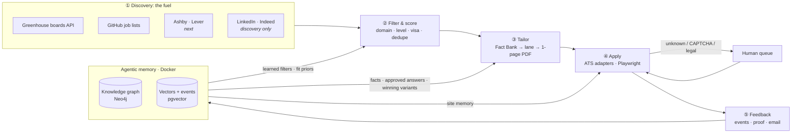
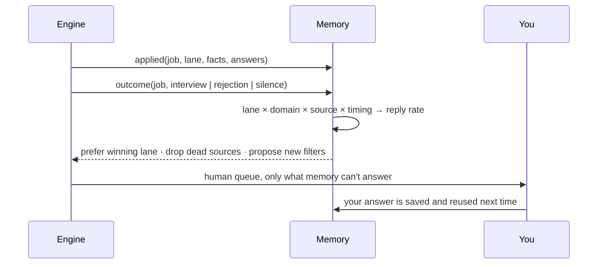

<div align="center">

# REGEN

### The open-source engine that finds jobs minutes after they're posted, and applies with nothing but the truth.

[](https://github.com/sameernagar-hub/regen-engine/actions/workflows/ci.yml)
[](https://github.com/sameernagar-hub/regen-engine/stargazers)
[](LICENSE)
[](pyproject.toml)
[](deploy/watcher.compose.yml)
[](SECURITY.md)
[](CONTRIBUTING.md)


<sub>The live view, replaying real activity with company names hidden. Each gold bead is an application sent <b>with proof</b>, grouped by the resume lane that wrote it.</sub>

**[Live demo](#-see-it-live)** · **[Quick start](#quick-start)** · **[How it works](#architecture)** · **[Roadmap](#roadmap)** · **[Contribute](CONTRIBUTING.md)**

</div>

---

## Why people star this

- ⚡ **First, not fiftieth.** It watches **~2,300 company job boards** (Greenhouse, Ashby, Lever, Workable) directly and flags new roles **minutes** after they go live, before they reach LinkedIn.
- 🧾 **Zero fabrication, by construction.** Resumes are assembled only from your Fact Bank. The code *cannot* invent a skill, number or employer, and every resume logs the exact facts it used.
- 🎯 **One resume per job.** Each posting gets its own one-page resume, routed to the right lane (backend, platform, full-stack, AI, data) and ordered by what the job asks for.
- 🛑 **Airbags.** Sensitive fields (SSN, bank, passwords), fees, unexpected sites, answers that drift from your presets, and rate caps all stop the engine and flag a human. There's a one-file kill switch.
- 🔒 **Local-first and private.** Your profile, history and browser session never leave your machine, and every merge to this repo passes an automated privacy gate.
- 📈 **Honest numbers.** `report` counts only applications with a confirmation screenshot on disk. No inflated "500 applied!" claims.
- 🌱 **Learns from replies.** Your inbox is classified (confirmation, OA, interview, rejection, offer, scam) and linked back to the exact application and resume lane.
- 🐳 **Always on.** A tiny hardened Docker service keeps listening while you sleep.

> If this is the kind of job-search tool you wish existed, **⭐ star the repo**. It's the easiest way to follow along, and it helps other job seekers find it.

## 👀 See it live
The live view is **not a dashboard**: it's one calm screen where work moves as light through *listening → judging → writing → applying → hearing back*, narrated one plain sentence at a time.
- **Public demo:** [](https://render.com/deploy?repo=https://github.com/sameernagar-hub/regen-engine). A free static site (`render.yaml`) that replays recent real activity, **anonymized** (no company names, no personal details; the build refuses to publish if a name would leak).
- **Your own:** `python -m engine live` → http://127.0.0.1:7777, or the `live` Docker service.

## What this is (and isn't)

**This isn't another auto-apply SaaS.** Tools like Jobright, LazyApply or Simplify Copilot are finished products: you use their UI, their filters and their pipeline, and your data lives on their servers.

**This is an engine.** It's the part underneath those products, open source and local-first, built to be embedded:

| Use it as… | How |
|---|---|
| **A project by itself** | Clone it, add your profile, and run `python -m engine scan → batch → apply`. |
| **A library** | `from engine.discovery.greenhouse import scan` and build your own app on top. |
| **A connector / plugin** *(v0.5)* | An MCP server, so Claude (Desktop or Code) or any agent can drive it in plain English, plus a REST API and webhooks for dashboards and other products. |

## Why it works

Most job seekers lose before they apply. A role is live on the company's own careers page for hours or days before it reaches LinkedIn, and by then hundreds of people are ahead. Auto-apply bots respond with volume: one generic resume sent 1,000 times through Easy Apply, until the account gets banned.

The engine makes the opposite bet:

| Principle | In practice |
|---|---|
| **Be early** | Poll about 2,300 company ATS boards (Greenhouse, Ashby, Lever, Workable) plus GitHub job lists and newgrad-jobs.com, and `watch` for postings that are minutes old. Apply at the source, not the mirror. |
| **Be specific** | Every job gets its own one-page resume, built from your **Fact Bank** and routed to the right **domain lane** (backend, platform, full-stack, AI…). |
| **Be honest** | The code can't invent a skill, number, employer or date. Tailoring only *selects and orders* Fact Bank entries, and every resume logs the fact ids it used. Legal answers come only from your presets; arbitration needs your per-company OK. |
| **Stay local** | Profile, history, resumes and browser session live on your machine. The only network calls are to public job APIs and the forms you apply to. No third-party service sees your data, and calls are kept to a minimum (dead boards skipped, lookups cached). |
| **Get smarter** | Every action and outcome becomes an event. The agentic memory turns events into a knowledge graph and refines what the engine does next. |

---

## Architecture



| Stage | Module | What it does |
|---|---|---|
| ① **Discovery** | `engine/discovery/` | Scans your list of Greenhouse boards in parallel (about 350 in seconds) plus the SimplifyJobs feed. Normalizes everything into one queue and tags each job's ATS. |
| ② **Filter** | `profile/domains.json` | Your domain as rules: titles, level, locations and sponsorship stance. Dedupes against every past application. |
| ③ **Tailor** | `engine/tailoring/` | Fetches the job description, routes it to a lane, builds a Fact-Bank-only resume, auto-fits it to one page, and flags questions that need you. |
| ④ **Apply** | `engine/apply/` | Fills ATS forms by DOM structure (no screenshot-and-click loops, about 10 s per form), submits only when every required answer is known, pauses for the Greenhouse email security code, and saves a full-page proof. |
| ⑤ **Feedback** | `engine/feedback/` | An append-only event log of every discovery, resume, application and outcome. This is the raw signal for learning. |
| **Memory** | `engine/memory/` + `deploy/` | Semantic memory (profile graph), episodic memory (jobs, applications, outcomes) and procedural memory (how each ATS works) in a local Neo4j + pgvector stack. |

The full design is in **[docs/ARCHITECTURE.md](docs/ARCHITECTURE.md)**. The original deep-dive design (sources, scoring funnel, outreach, costs) is in **[docs/PLAN.md](docs/PLAN.md)**.

### The feedback loop



The loop does three things. The human queue shrinks over time, because approved answers are reused. Resume lanes compete, and the one that gets replies wins. And the graph proposes new filters, such as "every job with a 2027 grad window has been a misfit, so exclude it."

---

## Scope

**In scope:**
- Automatic applications **within your domain**: discovery → filter → tailor → apply → verify.
- A **knowledge graph of your profile** (facts, skills, projects, preferences) in an agentic memory that runs in Docker.
- A **feedback loop** that refines filters, resume lanes and answers from real outcomes (confirmations, OAs, interviews, rejections).
- Being an **embeddable engine**: CLI, Python library, MCP server, REST API and webhooks, plugin packaging.
- Local-first by default. Your profile and history never leave your machine unless you connect a hosted store.

**Out of scope (by design):**
- Fabricating experience, or generating legal or attestation answers.
- Solving CAPTCHAs, or creating accounts on your behalf.
- Bot-applying on LinkedIn, Indeed or Handshake. Their terms forbid it, so they're used only for discovery and routing to the company's ATS.

---

## Status: v0.6 alpha

Built in the open, with every change itemized in **[CHANGELOG.md](CHANGELOG.md)** (what changed, why, and how to verify it). Live state and next steps are in **[docs/HANDOFF.md](docs/HANDOFF.md)**.

| Capability | State |
|---|---|
| Discovery: Greenhouse · Ashby · Lever · Workable (~2,300 boards, ~45 s per pass) | ✅ |
| `watch`: brand-new postings within minutes, webhook, always-on Docker service | ✅ |
| Sources: board harvest from public GitHub job lists · newgrad-jobs.com leads resolved to the employer's own ATS | ✅ |
| JD fit gate (eligibility, clearance, years, graduation window) | ✅ |
| Per-job Fact-Bank tailoring + coverage + fact-id audit log | ✅ |
| Greenhouse apply (email security-code step, proof screenshots) | ✅ |
| Ashby apply (pauses for a human when Ashby asks for one) | ⚠️ beta |
| Airbags + SOS email + kill switch | ✅ |
| Inbox outcome loop (`inbox`, `learn`) | ✅ |
| `report`: verified-only counts | ✅ |
| Live view + anonymized public site | ✅ |
| Privacy gate in CI on every merge | ✅ |
| Lever / Workable apply | 🔜 (resume prepared; you click apply) |
| Platform: Next.js + TypeScript UI, FastAPI + Pydantic API, Postgres | 🔜 v0.7 |
| Agentic memory (graph + vectors) · MCP / REST connectors | 🔜 |

---

## Quick start

```bash
git clone https://github.com/sameernagar-hub/regen-engine && cd regen-engine
pip install -r requirements.txt && playwright install chromium
cp -r profile.example profile           # fill in YOUR facts, presets, lanes, domains

python -m engine boards harvest         # grow the board registry from public GitHub job lists (daily is plenty)
python -m engine scan 1                 # Greenhouse + Ashby + Lever + Workable, last 24 h -> workspace/queue.json
python -m engine newgrad 1              # newgrad-jobs.com leads, resolved to the employer's own ATS
python -m engine watch 10               # or: poll every 10 min and print only brand-new matches
python -m engine feed 7                 # SimplifyJobs new-grad feed -> workspace/feed_queue.json
python -m engine batch b1 <id>,<id>     # fit gate + tailored resumes -> workspace/batches/b1.json
python -m engine inspect <job url>      # optional: every question on the form + the engine's answer
python -m engine apply batches/b1.json --dry   # fill only; check workspace/proof/
python -m engine apply batches/b1.json         # fill + submit (already-submitted jobs are skipped)
python -m engine status                 # outcomes from the event log
python -m pytest -q                     # tests (run on profile.example/, never your data)
```

Always-on discovery in Docker (small, no browser, read-only profile mount, auto-restart):

```bash
docker compose -f deploy/watcher.compose.yml up -d --build   # watcher (watch 10 --newgrad) + live view on http://127.0.0.1:7777
docker compose -f deploy/watcher.compose.yml logs -f         # live "NEW ..." lines; matches land in workspace/queue.json
python -m engine report                                      # verified submissions only (confirmation screenshot on disk)
```

Optional memory stack:

```bash
cp .env.example .env                    # set passwords
docker compose -f deploy/docker-compose.yml --env-file .env up -d
```

### Your profile (`profile/`, git-ignored)

| File | Purpose |
|---|---|
| `fact_bank.json` | The only source of resume content. Every bullet has an id and must be true. |
| `presets.json` | Standing answers: contact, location, work authorization, sponsorship, EEO, education. |
| `lanes.json` | Your domains as resume lanes (headline, summary, ordered fact ids) plus routing rules. |
| `domains.json` | Discovery filters: titles, level, excluded employers, US-only (defaults in `engine/discovery/filters.py`). |
| `answers.json` | *Optional.* Answers you approved once (`pattern`, `answer`, `source`), reused on every form. |

---

## Repository layout

```
regen-engine/
├── engine/                     the engine (Python package)
│   ├── __main__.py             CLI: scan · newgrad · watch · boards · feed · batch · tailor · inspect · apply · status
│   ├── config.py               profile/ and workspace/ paths
│   ├── discovery/              ① fuel: ats.py (4 ATS APIs + registry), scan, watch, newgrad, filters
│   ├── tailoring/              ③ Fact-Bank resume builder, per-job tailor + fit gate, batch builder
│   ├── apply/                  ④ Playwright ATS adapters, form inspector, human queue
│   ├── feedback/               ⑤ append-only event log
│   ├── memory/                 agentic memory: graph schema, design (v0.4)
│   └── connectors/             MCP / REST / plugin (v0.5)
├── deploy/docker-compose.yml   memory stack: Neo4j + Postgres/pgvector
├── profile.example/            templates for your private profile/
├── tests/                      pytest suite (runs on profile.example/)
├── CHANGELOG.md                every change: what, why, how to verify
├── workspace/                  runtime state (git-ignored): queue, resumes, proof, events
└── docs/
    ├── ARCHITECTURE.md         system design
    ├── PLAN.md                 original deep-dive design
    └── HANDOFF.md              current state, known bugs, how to resume
```

---

## Roadmap

| Release | Theme | Deliverables |
|---|---|---|
| **v0.1–0.3** ✅ | Engine core | Discovery · Fact-Bank tailoring with validator · Greenhouse/Ashby apply with proof · human queue · event log · CLI |
| **v0.4** ✅ | Sources & reliability | 4-ATS discovery · board registry + harvest · `watch` · newgrad-jobs leads · JD fit gate · per-job tailoring + audit log · `inspect` · answer bank · runner hardening · tests |
| **v0.5** ✅ | Safety & feedback | Airbags · SOS email · kill switch · inbox outcome loop · `learn` · verified-only `report` · Docker watcher |
| **v0.6** ✅ | Live engine | Not-a-dashboard live view · lane tree · anonymized public site · privacy gate in CI |
| **v0.7** | **Platform** | **Next.js + TypeScript** live view (App Router, Server-Sent Events, Canvas/WebGL) · **FastAPI + Pydantic** API over the engine (typed events, jobs, outcomes, human queue) · **Postgres** for events, jobs and outcomes (pgvector next) · Docker Compose for the whole stack · typed client generated from the OpenAPI schema |
| **v0.7** | Engine room | GPU-rendered live view: instanced board galaxy, glowing pipeline, 3D lane tree, bloom, render-on-demand within a small CPU budget ([research](docs/FRONTEND.md)) |
| **v0.8** | Coverage & lean | Lever + Workable adapters · Workday/iCIMS assist · conditional requests (skip unchanged boards) · adaptive concurrency |
| **v0.9** | Memory & connectors | Graph + vector memory · facts-for-JD retrieval · MCP server (`discover_jobs`, `tailor_resume`, `apply`, `queue_status`) · REST + webhooks |
| **v1.0** | First public release | One-command setup · docs site · stable APIs · branding |

Beyond v1: recruiter and hiring-manager outreach (always with your approval), interview-prep packets, multi-profile support.

---

## Guardrails

1. **No fabrication**: `resume.validate()` rejects anything not in the Fact Bank.
2. **No improvised legal answers**: they come from presets only. Unknown answers go to the human queue.
3. **No CAPTCHA bypassing and no bot-created accounts.**
4. **Discovery-only on LinkedIn, Indeed and Handshake.**
5. **Your data stays yours**: `profile/` and `workspace/` are git-ignored and local. Nothing goes to third-party services; network use is limited to public job APIs and the forms you apply to.
6. **Transparent**: every resume event lists the fact ids it used, every skipped job logs the JD reason, and every submission saves a full-page proof.
7. **Lean**: as few external calls as possible. Dead boards are skipped, resolutions are cached, and the first `watch` poll only seeds state.

## Privacy & security
Your data never belongs in this repo, and the repo enforces it. Every pull request and every push to `main` (the maintainer's included) runs a **privacy gate**. It checks for PII patterns, forbidden paths, non-noreply commit emails, and keyed fingerprints of the maintainer's private terms. Details are in **[SECURITY.md](SECURITY.md)**.

## Contributing
Good first contributions: ATS adapters (Lever, Workday, iCIMS), new discovery sources, live-view polish, memory ingesters. Read **[CONTRIBUTING.md](CONTRIBUTING.md)**. Use the fictional fixtures (`tests/fixtures/`, `profile.example/`), never real data.

## Star history
[](https://star-history.com/#sameernagar-hub/regen-engine&Date)

If REGEN helped you, or you just like the idea of an honest job engine, **⭐ star it** and share it with someone who's job hunting.

## License

[MIT](LICENSE)
