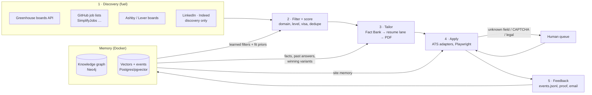
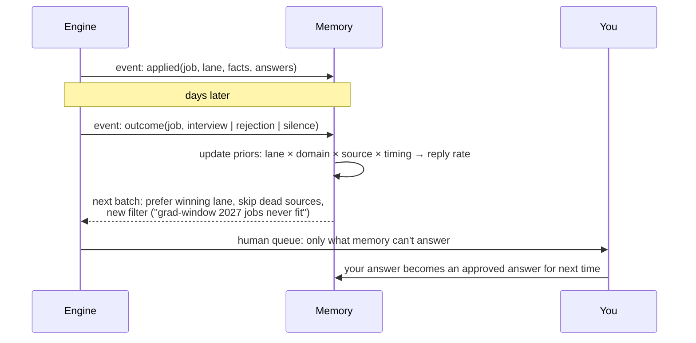

# Architecture

The engine is a pipeline of five stages around one shared memory. Each stage is a plain Python
module with a `main()` and a library function, so the same code runs from the CLI, a scheduler,
an MCP tool call, or another product.



## Stages

### 1. Discovery: `engine/discovery/`
| Module | Source | Why |
|---|---|---|
| `greenhouse.py` | `boards-api.greenhouse.io/v1/boards/{token}/jobs` for a list of company boards (`workspace/boards.txt`) | Postings appear here minutes after a recruiter publishes them, before syndication. Parallel scan of about 350 boards takes seconds. |
| `simplify.py` | SimplifyJobs new-grad `listings.json` | Community-curated, machine-readable, updated through the day. Each listing is tagged with its ATS. |
| *planned* `ashby.py`, `lever.py` | Public posting APIs | Same source-first idea for other ATSs. |
| *planned* `boards.py` | LinkedIn/Indeed search pages | **Discovery only.** Follow the listing to the company's own ATS and apply there. |

The output is a normalized queue (`workspace/queue.json`): `source, ats, token, id, company, title, location, posted, url`.

### 2. Filter + score
The domain filters live in `profile/domains.json`: title include/exclude, location include/exclude, and sponsorship stance.
Past application IDs (`workspace/ids.txt`, appended automatically after each submit) prevent duplicates.
*Planned:* an LLM fit score with hard constraints (clearance, grad window, citizenship) extracted from the job description, plus learned priors from memory.

### 3. Tailor: `engine/tailoring/`
- `profile/fact_bank.json` is the **only** source of resume content. Every bullet has an id.
- `profile/lanes.json` defines your **domains as resume lanes** (backend, platform, full-stack, AI…). A lane is a headline, a summary and an ordered list of fact ids, plus routing rules.
- `batch.py` fetches each job description, routes it to a lane, writes a spec, and builds the PDF. It also flags questions that need a human (years-of-experience attestations, export control, salary, "why us").
- `resume.py` has `validate()`, which **rejects any spec that references something not in the Fact Bank**, and `fit()`, which auto-fits the resume to one page.

### 4. Apply: `engine/apply/`
`runner.py` is a headed Playwright filler with one adapter per ATS, run by a round-robin scheduler (`scheduler.py`).

| ATS | Status | Notes |
|---|---|---|
| Greenhouse (`job-boards` + embed) | ✅ production | react-select dropdowns, phone country (“United States +1”), demographic decline, consent checkboxes, **email security codes per job** (`codes/<board>_<id>.wait`) |
| Ashby | ⚠️ beta | Yes/No buttons, CSS-only required markers, follow-up questions (second pass), resubmit once on “Missing entry”; 24 h cooldown after a bot flag |
| Lever | ⚠️ beta | Location autocomplete limited to your state/US, EEO selects declined, CAPTCHA → you |
| Workable | ⚠️ beta | Cloudflare Turnstile detected → you |
| Workday, iCIMS | planned | The user creates the account; the engine fills the forms |

```
            batch (interleaved by company)
                 │
        ┌────────▼────────┐   admit while a tab is free
        │  pending deque  │──────────────┐
        └─────────────────┘              ▼
   ┌──────────── ready deque ◄──── wake (heap pop, O(log S))
   │  popleft O(1)                      ▲
   ▼                                    │ yield <seconds>  (site is working)
 run job's generator in its tab ────────┤
   │  yield (checkpoint) and quantum used → append O(1) back to ready
   │  return → record event, free the tab, admit next
```

Answer order for every field: per-job extras → your approved answers (`profile/answers.json`) → the ordered rules
(presets only, 75 rules) → experience questions from your Fact Bank skills → **a drafted answer** for open-ended
questions (`drafts.py`, Fact Bank sentences only, logged with fact ids). Legal, EEO, salary and sensitive questions are
never drafted: unknown → the human queue. Before any submit the airbags run (sensitive fields, payments, unexpected
site, legal answers that drift from presets, rate caps). Every attempt saves a full-page proof screenshot.

### 5. Feedback: `engine/feedback/`
`events.py` is the append-only event log (`workspace/events.jsonl`): discovery, resume, application, outcome, answer,
schedule and flag events. Writes are locked across processes; reads are incremental. `inbox.py` classifies replies
(confirmation, OA, interview, rejection, offer, scam) into `outcome` events; `answers.py` is the one write path from
the web app (answer from the page). `engine/discovery/gmail_codes.js` + `engine/apply/codes.py` supply Greenhouse codes.

## Memory: `engine/memory/` + `deploy/docker-compose.yml`

A local Docker stack (Neo4j for the graph, Postgres + pgvector for vectors and events) holds three kinds of memory:

| Memory | Contents | Used by |
|---|---|---|
| **Semantic** (profile graph) | Facts → Skills → Projects → Roles, plus preferences | Tailor: pick the best facts for a JD by graph + vector similarity |
| **Episodic** (event graph) | Jobs, companies, applications, answers, resume variants, outcomes | Filter and Tailor: which variant, source and timing got replies |
| **Procedural** (site memory) | ATS field-label → preset mappings, failure signatures | Apply: unknown sites become deterministic after the first success |

The schema is in [`engine/memory/schema.cypher`](../engine/memory/schema.cypher).

## The feedback loop (how it refines itself)



- **Bandits** over strategy choices: resume lane, cover note on or off, apply-time window. The reward is a reply or advancing past the screen.
- **Approved answers**: anything you answer in the human queue is saved and reused, so the queue shrinks over time.
- **Learned filters**: the graph spots patterns (for example "these 40 jobs all require clearance") and proposes new exclude rules.

## Interfaces

| Interface | Status |
|---|---|
| CLI: `python -m engine scan / newgrad / alerts / batch / apply / codes / inbox / learn / report / status` | ✅ |
| REST API (`apps/api`, FastAPI): read endpoints + `POST /api/answers` (opt-in, localhost) | ✅ v0.8 |
| Web app (`apps/web`, Next.js): live view, memory graph, answer box | ✅ v0.8 |
| MCP server: read-only memory tools (`python -m engine mcp`) | ✅ |
| Webhooks: `REGEN_WEBHOOK` for new matches from `watch` | ✅ |

## Guardrails (enforced in code, not policy)

1. `resume.validate()`: no resume content outside the Fact Bank.
2. Legal and attestation answers only come from presets. Unknown → human queue. Drafts never touch them.
3. No CAPTCHA solving and no account creation by the engine.
4. LinkedIn, Indeed and Handshake are discovery only.
5. Personal data (`profile/`, `workspace/`) is git-ignored. The repo ships templates only.
