# Design document v1: the job-hunting engine (working name REGEN)

> A machine that runs on job postings. It finds openings before the big job boards do, decides
> which ones are worth it, writes a truthful resume for each one, applies, contacts the recruiter,
> tracks every reply, and learns from what works. It keeps running until you press STOP.

Status: original design doc, 2026-10-03. Current state: [HANDOFF.md](HANDOFF.md) · architecture: [ARCHITECTURE.md](ARCHITECTURE.md)

---

## 0. What makes this different (the "edge")

Most auto-apply tools (AIHawk, LazyApply, ApplyPilot, Simplify Copilot) do the same thing: scrape LinkedIn or Indeed, then fill out the Easy Apply form many times over. That approach has three problems. **They're late**, because the job has already been syndicated to LinkedIn, so 500 people are ahead of you. **They're dumb**, because every job gets the same resume. **They're fragile**, because LinkedIn bans the account. REGEN is built on six ideas that fix this:

| # | Idea | Why it wins |
|---|------|-------------|
| 1 | **Source-first discovery** | Poll the company's own applicant tracking system (ATS: Greenhouse, Lever, Ashby, Workday and others) every few minutes. A posting shows up there **minutes after a recruiter publishes it**. It reaches LinkedIn, Indeed or Glassdoor hours or days later. Apply at the source, not the mirror. |
| 2 | **GitHub list firehose** | Community repos (Simplify, speedyapply, vanshb03, zapplyjobs…) publish **machine-readable JSON** that updates throughout the day. A diff on that JSON catches everything a human curator spotted. |
| 3 | **Domain lanes + truthful tailoring** | Pick 3–5 role domains (e.g. Backend, ML, Data, Full-stack). Each domain has a base resume. Each job gets a variant tailored to it, built **only from a verified Fact Bank**, so nothing is ever made up. |
| 4 | **Knowledge graph** | Every job, company, skill, recruiter, question and outcome becomes a node. The graph spots patterns ("these 40 jobs all require clearance", "Ashby fintech jobs reply 3× more") and **writes new filters by itself**. |
| 5 | **Closed-loop learning** | Gmail is parsed for confirmations, rejections, online assessments and interviews. Outcomes go back into scoring, resume-variant choice and outreach strategy. |
| 6 | **Agent-native** | Everything is exposed as an **MCP server**, so Claude (Desktop or Code) can drive, inspect and steer the engine in plain English. |

---

## 1. Honest constraints (read this first)

People ask for "100% accuracy and no loopholes". No system that touches thousands of third-party websites can promise that. What REGEN *can* promise is something better:

> **Zero silent failures.** Every action is verified, saved with proof, or sent to you for a decision.
> Nothing is reported as "applied" unless there is proof: a screenshot of the confirmation page *and/or* a confirmation email.

Hard rules built into the design:

1. **No fabrication.** Claude may reword, reorder, emphasize and pick keywords. It may **never** invent a skill, employer, degree, metric or date. Every resume bullet carries the `fact_id` it came from. A validator rejects any bullet whose claim can't be traced to a fact. Fabricated resumes get offers rescinded after background checks, so this protects you.
2. **LinkedIn, Indeed, Glassdoor and Handshake run in *Assist mode*, not Auto mode.** Their terms of service forbid bots, and in 2026 they enforce it hard: reports show restriction rates of about 23–40% for accounts running automation tools. REGEN uses these sites for **discovery** and **routing**. Most of their listings link out to a company ATS anyway, and REGEN applies there directly. For true Easy Apply or Handshake-only jobs, it prepares a complete packet (resume, answers, cover letter). You submit with one click.
3. **CAPTCHAs are never bypassed.** No solver services, no fingerprint spoofing, no proxy rotation. If a form shows a challenge, the job goes to a **Human Queue** with a push notification. You solve it in about 10 seconds, and the engine continues from the same browser session. Running from your home PC, with a real Chrome profile at human pace, keeps challenges rare.
4. **Google sign-in can't be fully automated.** Google blocks sign-ins from automated browsers. Instead, you sign in **once** inside REGEN's persistent Chrome profile, and the engine reuses that session for every "Sign in with Google" button. Some sites need their own account; Workday needs a separate account for *every* company. For those, the engine creates the account with your email and a unique generated password. The password goes to an encrypted local vault (OS keychain), and the engine reads the verification email through the Gmail API.
5. **Legal and attestation questions are never improvised.** Work authorization, sponsorship, criminal history, EEO and demographic questions, non-compete and "I certify" checkboxes all come from **your pre-set answers**. They are never generated by the model.
6. **Rate and fairness caps.** At most N applications per company per 30 days (default 3). Applying to 25 roles at one company tells the recruiter you're spamming. Cold email is capped at about 20 per day, gets at most one follow-up, and is always one-to-one and personal.

These rules don't make the engine weaker. They're why it can run for months without getting you banned or blacklisted.

---

## 2. System architecture

```mermaid
flowchart LR
  subgraph SOURCES["⛽ Job Fuel (Scouts)"]
    A1[ATS Watchers<br/>Greenhouse · Lever · Ashby<br/>Workable · SmartRecruiters · Workday]
    A2[GitHub List Diffing<br/>Simplify · speedyapply · vanshb03 …]
    A3[Aggregators<br/>JobSpy: LinkedIn/Indeed/Glassdoor/ZipRecruiter/Google]
    A4[Free APIs<br/>HN Who's Hiring · RemoteOK · Remotive<br/>Arbeitnow · The Muse · USAJobs · Adzuna]
    A5[Career-page change detection<br/>for non-standard sites]
  end

  SOURCES --> N[Normalizer + Deduper<br/>canonical job ID]
  N --> KG[(Postgres + pgvector<br/>Knowledge Graph + Memory)]
  KG --> S[Scorer<br/>rules → embeddings → Claude]
  S -->|fit ≥ threshold| T[Tailor<br/>domain resume → job variant<br/>answers · cover letter]
  T --> V[Truth Validator<br/>every claim ↔ Fact Bank]
  V --> AP[Applier<br/>Playwright ATS adapters]
  AP -->|captcha / unknown field / low confidence| HQ[Human Queue 📱]
  HQ --> AP
  AP -->|proof: screenshot + DOM + email| KG
  T --> OR[Outreach<br/>find recruiter → draft → send]
  OR --> GM[Gmail API]
  GM --> IW[Inbox Watcher<br/>classify replies]
  IW --> KG
  KG --> L[Learner<br/>bandits · filter synthesis · answer bank]
  L --> S
  KG --> D[Dashboard + Daily Report]
  MCP[[REGEN MCP Server]] <--> KG
  MCP <--> CTRL[Engine Control<br/>start · stop · pause · mode]
  Claude([Claude Desktop / Claude Code]) <--> MCP
```



### 2.1 The engine loop

REGEN is a **long-running daemon** (a Python asyncio supervisor) with independent workers. They talk through a Postgres job queue that uses `SELECT … FOR UPDATE SKIP LOCKED` (no Redis needed). Each worker can crash and restart without losing work.

| Worker | Cadence | Responsibility |
|---|---|---|
| `scout.ats` | Every 5–10 min per company (tiered; see §3.1) | Diff ATS boards and emit `job.discovered` |
| `scout.github` | Every 10 min | Conditional GET (ETag) on the JSON lists; a 304 is free |
| `scout.aggregators` | Every 60 min | JobSpy and the free APIs, last 24 h only |
| `normalizer` | Event-driven | Canonical schema, dedupe, link to company and ATS |
| `scorer` | Event-driven | 3-stage funnel (rules → embedding → Claude) |
| `tailor` | Event-driven | Resume variant, answers, cover letter |
| `validator` | Event-driven | Truth check, ATS-parse check, formatting check |
| `applier` | Continuous, 1–2 browsers | Submit, capture proof, retry or escalate |
| `outreach` | 3 windows per day, business hours of the target's time zone | Find contact, draft, send (approval mode first) |
| `inbox` | Every 5 min | Gmail watch, classify, update statuses |
| `learner` | Nightly + on every outcome | Update priors, synthesize filters, prune memory |
| `reporter` | 08:00 daily + live | Daily report, weekly analytics |

**Start/stop:** `regen start` / `regen stop` / `regen pause applier`, the dashboard's big red button, or the MCP tool `engine_control`. STOP is graceful: in-flight submissions finish or roll back, then every worker parks. There is also a hard **kill switch** file (`~/.regen/STOP`) that every worker checks before each external action.

**Modes** (set per source and per ATS):
- `observe`: discover and score only.
- `assist`: prepare everything; you approve each submit (the default for week 1).
- `auto`: submit when confidence ≥ threshold; otherwise send to the Human Queue.

---

## 3. Job fuel: discovery sources (deep research)

### 3.1 Tier 1: company ATS boards (the "before everyone else" layer)

These are **public, unauthenticated JSON endpoints**: the same calls the company's own careers page makes in your browser.

| ATS | List endpoint | Notes |
|---|---|---|
| Greenhouse | `GET https://boards-api.greenhouse.io/v1/boards/{slug}/jobs?content=true` | `updated_at` per job; huge share of startups and mid-size tech |
| Lever | `GET https://api.lever.co/v0/postings/{slug}?mode=json` | `createdAt` in ms |
| Ashby | `GET https://api.ashbyhq.com/posting-api/job-board/{slug}?includeCompensation=true` | Has comp data; many AI startups |
| Workday | `POST https://{tenant}.wd{N}.myworkdayjobs.com/wday/cxs/{tenant}/{site}/jobs` body `{"appliedFacets":{},"limit":20,"offset":0,"searchText":""}` | Fortune-500 heavy (NVIDIA, Salesforce, Adobe…). Sort by "Posted Today". About 2,000 results max per query, so search by facet. |
| SmartRecruiters | `GET https://api.smartrecruiters.com/v1/companies/{id}/postings` | Public |
| Workable | `GET https://apply.workable.com/api/v3/accounts/{slug}/jobs` (POST) | Public |
| Others | iCIMS, Jobvite, Taleo, Oracle Cloud, BambooHR, Rippling, Recruitee | Adapters added one at a time; fall back to career-page diffing |

**How you get the company list (the "company universe"):**
1. Seed from the GitHub lists: each listing's `url` reveals the company's ATS and slug (e.g. `polaris.wd5.myworkdayjobs.com/PolarisJobs` gives tenant, shard and site).
2. Seed from HN "Who is hiring" posts and YC's company directory.
3. **Auto-expand:** every new job seen on any aggregator is resolved to its ATS link, and the company joins the watch list.
4. **Tiered polling.** Tier A (your dream companies plus high reply rate) is polled every 5 min. Tier B every 30 min. Tier C every 3 h. The learner promotes and demotes companies automatically.

Result: for watched companies, REGEN usually has the posting **before** it is indexed by LinkedIn or Indeed, often hours ahead. Being among the first 20–50 applicants is the single biggest controllable factor.

### 3.2 Tier 2: GitHub job lists (verified live today)

These publish **structured JSON**. REGEN never scrapes the README; it reads the data file.

| Repo | What | Machine-readable feed |
|---|---|---|
| [SimplifyJobs/New-Grad-Positions](https://github.com/SimplifyJobs/New-Grad-Positions) | New grad SWE / Quant / PM | `raw.githubusercontent.com/SimplifyJobs/New-Grad-Positions/dev/.github/scripts/listings.json` ✅ verified |
| [SimplifyJobs/Summer2027-Internships](https://github.com/SimplifyJobs/Summer2027-Internships) | Summer 2027 interns (SWE, DS, AI, quant, PM, hardware) | `…/Summer2027-Internships/dev/.github/scripts/listings.json` ✅ verified |
| [speedyapply/2027-SWE-College-Jobs](https://github.com/speedyapply/2027-SWE-College-Jobs) | SWE intern + new grad, USA + international | README tables (parser needed) |
| [vanshb03/New-Grad-2027](https://github.com/vanshb03/New-Grad-2027) | New grad SWE / Quant / PM | repo data / README |
| [vanshb03/Summer2027-Internships](https://github.com/vanshb03/Summer2027-Internships) | Internships (CSCareers) | repo data / README |
| [zapplyjobs/New-Grad-Jobs-2027](https://github.com/zapplyjobs/New-Grad-Jobs-2027) | Entry-level across tech, finance, healthcare, business | README |
| [zshah101/Automated-List-Of-Summer-2027…](https://github.com/zshah101/Automated-List-Of-Summer-2027-and-Fall-2026-Tech-Internships) | Auto-updated every 30 min from about 4,300 employer boards, with H-1B sponsor data | README |
| [jobright-ai 2026/2027 SWE New Grad](https://github.com/jobright-ai) | New grad SWE, updated daily | README |
| [sndsh404/summer-2027-internships](https://github.com/sndsh404/summer-2027-internships), dreamworkhq/Tech-Internships-2027 | Internships | README |

Each listing record carries `id`, `company_name`, `title`, `url`, `locations`, `date_posted`, `sponsorship`, `active` and `terms`. REGEN diffs by `id`. A record that flips `active: false` marks the job closed in the graph, and its pending submissions are cancelled. Use a GitHub personal access token (free) for 5,000 requests per hour. ETag conditional requests that return 304 cost nothing.

### 3.3 Tier 3: big boards (discovery + routing, Assist-only for applying)

| Platform | Discovery method | Apply method |
|---|---|---|
| LinkedIn | JobSpy (guest endpoints, low volume, last 24 h); Google Jobs | Resolve to company ATS and apply there. Easy Apply-only jobs: **Assist packet** |
| Indeed | JobSpy | Resolve to ATS; else Assist |
| Glassdoor | JobSpy | Resolve to ATS; else Assist |
| ZipRecruiter | JobSpy | Resolve to ATS; else Assist |
| Google for Jobs | JobSpy `google` / SerpApi free tier | Usually links to the ATS, so apply directly |
| Handshake | No API; behind university login. You export or REGEN reads your saved jobs **only if you open them** | Assist packet |
| Monster / Dice / Wellfound / YC Work at a Startup | Light scraping or RSS where available | ATS or Assist |

### 3.4 Tier 4: free public APIs

- **HN "Who is hiring"**: `hn.algolia.com/api/v1/search_by_date?tags=comment,story_<id>`. Posts often include the **hiring person's email**, which feeds outreach.
- **RemoteOK** (`remoteok.com/api`), **Remotive** (`remotive.com/api/remote-jobs`), **Arbeitnow**, **The Muse**, **USAJobs** (free key), **Adzuna** (free key).

### 3.5 Dedupe: one job, one identity

The same job can arrive from 5 sources. Canonical key = `normalize(company) + ATS job ID`. If there is no ATS ID, fall back to `simhash(title + location + first 500 chars of the job description)`. Merging is source-priority aware: ATS beats GitHub list, which beats aggregator. The graph keeps every `SEEN_ON` edge, so REGEN learns **which source surfaces jobs first**.

---

## 4. The candidate model: Profile, Fact Bank and Domains

The resume is generated from data, not edited by hand.

```
profile/
  identity.yaml        # name, contact, links, address, work-auth, sponsorship, relocation, start date, salary rules
  attestations.yaml    # pre-set answers for legal/EEO/background questions (YOU fill this; never AI)
  facts.yaml           # the Fact Bank: atomic, verified facts
  domains.yaml         # role lanes + per-domain base resume config
  preferences.yaml     # locations, remote, company size, industries, deal-breakers, dream companies
  documents/           # transcript, portfolio, writing samples
```

**Fact Bank example** (every resume bullet must trace back to entries like these):
```yaml
- id: F-acme-01
  org: Acme Corp
  role: Software Engineering Intern
  dates: 2025-06..2025-08
  claim: "Built a Kafka→Postgres ingestion service handling ~2M events/day"
  skills: [kafka, postgres, python, distributed-systems]
  metrics: {events_per_day: 2000000}
  evidence: "github.com/you/ingest, manager reference"
  verified: true
```

**Domains** (you choose these in onboarding, e.g.):
`backend-swe`, `ml-engineer`, `data-engineer`, `fullstack`, `quant-dev`. Each domain gets a **base resume**: section order, which projects lead, and the summary line. It is generated once, reviewed by you once, and locked.

### 4.1 Per-job tailoring pipeline

1. **Job description parse** (Claude, structured output): must-haves, nice-to-haves, years, stack, seniority, sponsorship stance, clearance, location rules, the hidden "real" requirements, keywords, and the team's problem.
2. **Domain pick:** route to the closest domain by embedding similarity and rules.
3. **Fact selection:** rank facts by relevance to the job (embedding + skill overlap + recency + metric strength).
4. **Rewrite:** Claude rewrites the selected bullets to mirror the job's vocabulary *where truthful* (e.g. "event streaming" becomes "Kafka" only if fact F-acme-01 says Kafka).
5. **Truth Validator:** a second, independent Claude call plus deterministic checks. Every bullet must match a fact ID, no new numbers, no new technologies, dates unchanged. If it fails, the bullet is regenerated; after 2 failures, the base bullet is used.
6. **ATS parse check:** render to PDF (Typst or LaTeX "Jake's Resume"-style, single column, no tables or icons). Run `pdftotext` and confirm every section parses. Compute keyword coverage against the job.
7. **Output:** `resume_<company>_<jobid>.pdf`, plus cover letter (only if asked or the field is required) and the answers JSON.

### 4.2 Application questions

- **Answer Bank** (memory): every question you've ever answered or approved is stored with its embedding. A new question is matched by similarity. Above 0.92 the answer is reused, adapted to the company. Otherwise Claude drafts an answer from facts plus company research, and in `assist` mode you approve it. Approved answers enter the bank, so the engine gets more autonomous every day.
- **Field typing:** yes/no, dropdown, number, date, free text, file. Dropdowns are matched to the closest option by meaning, with a confidence score. Low confidence goes to the Human Queue.
- **Company research snippet:** about 150 words pulled from the job description, the company site and recent news. It feeds "Why us?" answers so they aren't generic.

---

## 5. The Applier: how forms actually get filled

**Tech:** Playwright (Python), running **your installed Chrome** (`channel="chrome"`) with a persistent profile at `~/.regen/chrome-profile`. You sign in to Google there once.

**Adapter architecture** (one per ATS family, plus a generic fallback):
```
adapters/
  greenhouse.py   lever.py   ashby.py   workday.py   smartrecruiters.py
  workable.py     icims.py   generic_llm.py
```
Each adapter implements:
`open(job) → detect_auth() → login_or_create_account() → walk_steps() → fill(field) → upload(resume) → review() → submit() → verify()`

- **Known ATSs** (Greenhouse, Lever, Ashby) use deterministic field maps (label → profile field). These are fast and close to 100% reliable.
- **Workday** is multi-step and needs an account per tenant. The adapter handles "My Information → Experience → Questions → Voluntary Disclosures → Self-Identify → Review". It parses your resume into Workday's experience fields and then **corrects** the mis-parsed fields from the Fact Bank.
- **Generic LLM adapter** (any unknown site): read the accessibility tree, have Claude map fields to profile data with confidence scores, fill, screenshot, and have Claude verify. Every successful run **teaches the selector memory** for that domain, so the next run on that site is deterministic.
- **Verification:** "applied" requires the confirmation page text or URL **and** a screenshot, and is upgraded when the confirmation email arrives. Proof is stored with the application.
- **Pacing:** human-like delays, 1–2 concurrent browsers, active hours only (configurable), at most N submissions per hour.

**Escalation to the Human Queue** happens on: a CAPTCHA, an unknown required field, a low-confidence dropdown, an account email-verification timeout, a payment request (never pay to apply; that's a scam signal), or any "I certify" box not covered by `attestations.yaml`. You get a push notification (ntfy / Telegram / Discord). You resolve it in the dashboard or the live browser window, and the engine resumes.

---

## 6. Outreach: the recruiter and hiring-manager layer

### 6.1 Finding the human
In priority order (free first):
1. **The job description itself**: "contact jane@…", or the recruiter's name in the posting. HN posts often include emails.
2. **The ATS posting metadata**: some Lever and Ashby boards expose the hiring team.
3. **Company team, about and blog pages**, plus **GitHub org members** for engineering managers on public profiles.
4. **Email pattern inference**: learn the company's pattern from any known email (`first.last@`, `flast@`). Check the domain's MX record (DNS only; no SMTP probing, because that is unreliable and frowned upon).
5. **Hunter.io free tier** (about 25 searches per month) and **Apollo free tier** (about 100 credits per month on a personal email). Spend them only on jobs with score ≥ 85.
6. LinkedIn profile lookup is **manual**: REGEN gives you the search link and a drafted connection note.

### 6.2 The message
- Claude drafts 90–130 words: a specific hook (their product, team or recent launch), 2 proof points from your Fact Bank matched to the job, and a clear ask. The application link is included.
- Sent from **your Gmail via the Gmail API**, one-to-one, plain text, no tracking pixels. At most 20 per day, at most 1 follow-up after 5 business days, and it stops on any reply.
- **Approval mode by default.** Auto-send only after you've approved about 30 drafts and the learner sees a stable approval rate.

---

## 7. Tracking: what happened to every application

**State machine:**
```
discovered → scored → (rejected_by_filter | queued) → tailored → validated
→ (needs_human) → submitted → confirmed → (oa | recruiter_screen | interview_1..n | offer)
                                        → rejected | ghosted(30d) | withdrawn
```
- **Inbox Watcher** (Gmail API, `history.list` polling or push): Claude classifies each email (confirmation, rejection, online assessment, scheduling request, interview, offer, recruiter reply, other) and links it to the application by company, job ID and thread. Online-assessment and interview emails trigger an **urgent push**, and a calendar hold is drafted.
- **Workday and portal status checks:** weekly, log into tenant portals and read the candidate home status.
- **Dashboard** (live): a pipeline Kanban, today's discoveries, the Human Queue, a source leaderboard (who surfaces jobs first), response rate by domain, resume variant, source and time-to-apply, the outreach log, and the knowledge-graph explorer.
- **Daily report** (08:00, email + PDF + MCP resource): what was found, applied to and skipped (with reasons), replies received, actions needed from you, and what the learner changed.

---

## 8. Knowledge graph

### 8.1 Schema
**Nodes:** `Job`, `Company`, `ATS`, `Source`, `Skill`, `RoleFamily`, `Domain`, `Location`, `Person` (recruiter or hiring manager), `Application`, `ResumeVariant`, `Question`, `Answer`, `Outcome`, `Constraint`.

**Edges:**
```
(Job)-[:POSTED_BY]->(Company)-[:USES]->(ATS)
(Job)-[:SEEN_ON {first_seen_at, lag_min}]->(Source)
(Job)-[:REQUIRES {must:bool, years}]->(Skill)
(Job)-[:HAS_CONSTRAINT]->(Constraint)        # clearance, no-sponsorship, onsite-only, 5+yrs, degree=MS…
(Job)-[:SIMILAR_TO {cos}]->(Job)               # embedding cosine ≥ 0.85
(Job)-[:IN_FAMILY]->(RoleFamily)-[:MAPS_TO]->(Domain)
(Application)-[:FOR]->(Job)  (Application)-[:USED]->(ResumeVariant)
(Application)-[:RESULTED_IN]->(Outcome)
(Job)-[:ASKS]->(Question)-[:ANSWERED_WITH]->(Answer)
(Person)-[:RECRUITS_FOR]->(Company)  (Person)-[:CONTACTED {at, replied}]->(Application)
(Skill)-[:CO_OCCURS {n}]->(Skill)
```

### 8.2 What the graph does (this is how it writes new filters)
1. **Constraint propagation.** A rejection email (or a parsed job description) shows a hard blocker, such as "US citizenship required", "TS/SCI" or "5+ yrs". REGEN attaches a `Constraint` node, finds every `SIMILAR_TO` job sharing it, and down-ranks them or skips them as a **candidate filter**. If the same constraint blocks 3 or more applications, the filter is promoted to `active` automatically. You can see and override every filter it creates.
2. **Similarity reuse.** Jobs in the same similarity cluster reuse the best-performing resume variant and answers from that cluster.
3. **Skill-gap radar.** It counts `REQUIRES` edges on high-fit jobs you *don't* match and surfaces "learning 'Terraform' would unlock 14% more of your target jobs".
4. **Company intelligence.** It tracks reply rate, time-to-response and ghost rate per company and per ATS. Fast responders get Tier-A polling.
5. **Source lag analytics.** `SEEN_ON.lag_min` shows which source finds each company's jobs first, so polling budget goes where it pays off.

### 8.3 Storage
**Postgres + pgvector** with `nodes` and `edges` tables (typed and JSONB properties) and recursive CTEs for traversal. One database for queue, graph, memory and vectors, so there is nothing extra to run. Optional: mirror to Neo4j AuraDB Free for visual exploration. The dashboard renders the graph with Cytoscape.js.

> An **InsForge** project is one hosted option. InsForge is Postgres-based and gives auth, storage (resume PDFs and proof screenshots), realtime (live dashboard), edge functions and schedules on a free tier. It's a good fit for the hosted dashboard and database. Browser automation still runs on your PC.

---

## 9. Memory and learning ("it learns from what it does")

| Memory type | What's stored | How it's used |
|---|---|---|
| **Semantic: Answer Bank** | Question → approved answer (+ embedding, company context) | Reused or adapted; fewer human approvals over time |
| **Procedural: Site Memory** | Per domain/ATS: field selectors → profile keys, step order, quirks, failure signatures | Generic adapter becomes deterministic on 2nd visit |
| **Episodic: Action Log** | Every action, input, output, proof, error | Debugging, audit, Claude recalls "what happened with Acme?" |
| **Outcome Memory** | Application features → outcome | Trains the scorer and the strategy bandits |
| **Preference Memory** | Your approvals, edits, rejections of drafts/jobs | Learns your taste; tunes thresholds |

**Learning mechanics (simple, robust, explainable):**
- **Thompson-sampling bandits** over strategy choices: resume variant style, cover letter on/off, outreach on/off, apply-time window. Reward = recruiter reply or advancing past screen.
- **Scorer calibration:** logistic regression on features (fit score, source, minutes since posted, company tier, ATS, domain, outreach sent) predicting P(response). It is retrained nightly once there are 100 or more outcomes. Until then, use priors.
- **Filter synthesis** from the graph (§8.2).
- **Memory hygiene:** nightly dedupe, decay of stale site memories, conflict detection ("two different answers to the same question"), which go to you.

---

## 10. The REGEN MCP server

Built with the official MCP Python SDK (FastMCP). It runs locally (stdio) and plugs into Claude Desktop and Claude Code. That lets you say: *"Pause the applier, show me today's Human Queue, and draft emails for every ML job above 90."*

**Tools**
| Tool | Purpose |
|---|---|
| `engine_control(action: start\|stop\|pause\|resume, worker?)` | The on/off switch |
| `engine_status()` | Workers, queue depths, today's counters, errors |
| `search_jobs(query, filters, since)` | Query discovered jobs |
| `get_job(job_id)` | Full job + parsed JD + score breakdown + graph neighbors |
| `score_job(job_id)` / `rescore(filter)` | Force (re)scoring |
| `tailor_resume(job_id, domain?)` | Generate/validate variant, return PDF path + diff vs base |
| `answer_questions(job_id)` | Draft answers with confidence + sources |
| `apply(job_id, mode: assist\|auto)` | Queue a submission |
| `human_queue()` / `resolve(item_id, data)` | See and clear blockers |
| `find_contacts(job_id)` | Recruiter / hiring-manager candidates with confidence |
| `draft_outreach(job_id, contact_id)` / `send_outreach(draft_id)` | Cold email (send requires approval flag) |
| `pipeline(status?, since?)` / `update_status(app_id, status, note)` | Tracking |
| `kg_query(question)` | Natural-language → graph query (e.g. "companies that ghosted me after OA") |
| `filters_list()` / `filter_set(id, active)` | Inspect and override auto-generated filters |
| `memory_recall(query)` / `memory_write(kind, content)` | Long-term memory |
| `report(day?)` | Daily report |

**Resources:** `regen://profile`, `regen://facts`, `regen://report/today`, `regen://filters`, `regen://pipeline`.
**Prompts:** `weekly-review`, `prep-interview(app_id)` (pulls the job description, company research, your matching facts and likely questions).

The MCP server is the **control plane**. The daemon is the **data plane**, so the engine keeps running with Claude closed.

---

## 11. Scoring funnel (keeps cost low and quality high)

Thousands of jobs per day come in, but Claude only sees the promising ones.

1. **Hard filters** (free, instant): location, work authorization or sponsorship, seniority keywords, clearance, deal-breakers, closed or stale (>24 h for the "last 24 h" pass, though Tier-A companies are always considered), per-company cap, and **graph-generated filters**. Typically removes 70–90%.
2. **Embedding similarity** (free, local `bge-small` / `all-MiniLM` via sentence-transformers): job vs each domain profile. Keep the top ~15–25%.
3. **Claude structured scoring** (paid): must-have coverage, seniority fit, sponsorship stance, red flags and a 0–100 fit score, with reasons. Non-urgent jobs go through the **Batch API (50% cheaper)**. Fresh Tier-A jobs use real-time calls so speed is kept.

`priority = fit × freshness_boost(minutes_since_posted) × company_tier × P(response | features)`

---

## 12. Services: free vs paid

### 12.1 What costs money
| Service | Needed? | Cost |
|---|---|---|
| **Claude API** (scoring, job-description parsing, tailoring, answers, outreach, inbox classification) | **Yes, the brain** | Pay-as-you-go, **no free tier**. See §12.3 |
| Hunter.io / Apollo beyond free | Optional | Free tiers ≈ 25–50 credits/mo (Hunter), ≈ 100 credits/mo (Apollo, personal email) |
| SerpApi / JSearch beyond free | Optional | Small free tiers; JobSpy covers most of this for free |
| VPS | Optional | Not recommended: datacenter IPs get challenged far more. Run on your PC |

### 12.2 What's free
| Need | Free option |
|---|---|
| Browser automation | Playwright + your Chrome |
| ATS job feeds | Greenhouse / Lever / Ashby / Workday / SmartRecruiters / Workable public endpoints |
| GitHub lists | raw.githubusercontent + GitHub API (5k req/h with token, 304s free) |
| Aggregator scraping | JobSpy (`pip install python-jobspy`), low volume |
| Other job APIs | HN Algolia, RemoteOK, Remotive, Arbeitnow, The Muse, USAJobs, Adzuna (free keys) |
| Email send/read | Gmail API (free, your account) |
| Google sign-in | Your session in the persistent Chrome profile |
| Database / graph / vectors / queue | Postgres + pgvector (local Docker, or an **InsForge** project, or Supabase free) |
| Embeddings | sentence-transformers locally |
| Resume rendering | Typst or LaTeX (Tectonic) |
| PDF parse check | `pdftotext` / pypdf |
| Secrets | OS keychain via `keyring` |
| Notifications | ntfy.sh / Telegram bot / Discord webhook |
| Dashboard | FastAPI + HTMX (or Next.js on InsForge or a free static host) |
| Scheduler | The daemon itself; Windows Task Scheduler to auto-start on boot |
| MCP | MCP Python SDK |

### 12.3 Claude cost estimate (Claude API list prices, 2026-09)
Default model: **Claude Opus 5.5** (`claude-opus-5-5`, $4 in / $20 out per 1M tokens; cache reads $0.20/M). Your profile and Fact Bank go in a **cached prompt prefix**, so after the first call each request pays mostly cache-read rates on that bulk.

Rough per-application token budget (cached prefix ~8k tokens):

| Step | Fresh input | Output (incl. thinking) | ≈ Cost on Opus 5.5 |
|---|---|---|---|
| JD parse + score | 3k | 1k | $0.032 |
| Tailor resume + validate | 5k | 4k | $0.10 |
| Answers (avg 5 questions) | 3k | 2k | $0.052 |
| Outreach draft (~40% of apps) | 2k | 1k | ~$0.01 |
| **Per application** | | | **≈ $0.20** |
| Scoring-only (jobs that don't reach apply) via Batch | 3k | 0.8k | ≈ $0.014 each |

**Example:** 40 applications/day + 400 jobs scored/day comes to about $8 + $5.6, or **≈ $14/day (~$400/mo)**. Levers you control:
- **Claude Sonnet 5.5** ($2 / $10) costs roughly half (**≈ $200/mo**). Quality on JD parsing and classification is usually indistinguishable; for resume writing, test it against Opus on 20 jobs before switching.
- **Claude Haiku 4.5** ($1 / $5) is a candidate for inbox classification only.
- Lower effort on routine calls (scoring, classification), higher effort on resume rewriting.
- Tighter funnel filters, so fewer Claude calls.
- **Alternative brain:** run the REGEN MCP inside Claude Code / Claude Desktop on your existing Claude plan for the *interactive* parts (reviews, outreach drafting, human-queue decisions). Keep only the always-on worker calls on the API.

---

## 13. Tech stack

- **Language:** Python 3.12 (Playwright, JobSpy, FastMCP, sentence-transformers all live here)
- **Core libs:** `playwright`, `python-jobspy`, `httpx`, `pydantic`, `claude SDK`, `mcp`, `psycopg[binary]` + `pgvector`, `sentence-transformers`, `google-api-python-client` (Gmail), `keyring`, `typst`/`tectonic`, `apscheduler` (light timers), `structlog`
- **Data:** Postgres 16 + pgvector (local Docker or InsForge)
- **UI:** FastAPI + HTMX + Cytoscape.js (or Next.js if hosting on InsForge)
- **Runs on:** your Windows PC (residential IP, real Chrome), auto-start at login

```
regen-engine/
  regen/
    supervisor.py          # starts/stops workers, kill switch
    queue.py               # Postgres SKIP LOCKED queue
    scouts/                # ats_greenhouse.py, ats_lever.py, ats_ashby.py, ats_workday.py, github_lists.py, jobspy_scout.py, hn.py, free_apis.py
    normalize/             # schema.py, dedupe.py, ats_resolver.py
    score/                 # rules.py, embed.py, llm_score.py, calibrate.py
    tailor/                # jd_parse.py, select_facts.py, rewrite.py, validator.py, render_typst.py, ats_check.py, answers.py
    apply/                 # browser.py, adapters/*, verify.py, human_queue.py
    outreach/              # finder.py, patterns.py, draft.py, gmail_send.py
    inbox/                 # gmail_watch.py, classify.py, link.py
    graph/                 # model.py, build.py, similarity.py, constraints.py, queries.py
    memory/                # answer_bank.py, site_memory.py, episodic.py, bandits.py
    report/                # daily.py, templates/
    mcp_server.py
    dashboard/
  profile/                 # identity.yaml, attestations.yaml, facts.yaml, domains.yaml, preferences.yaml
  migrations/
  tests/                   # adapter tests against saved HTML fixtures
```

---

## 14. Roadmap (build order)

| Phase | Deliverable | "Done" means |
|---|---|---|
| **0. Foundation** (2–3 days) | Profile, Fact Bank interview (Claude interviews you), domains, attestations, Postgres schema | You've approved base resumes for each domain |
| **1. Fuel** (week 1) | Scouts: GitHub lists, Greenhouse, Lever, Ashby, Workday, JobSpy, HN; normalizer + dedupe; minimal dashboard | ≥ 1,000 unique jobs/day ingested, dedupe precision spot-checked ≥ 99% |
| **2. Brain** | Scoring funnel, job-description parser, knowledge graph build, similarity edges | Top-50 daily list that *you* agree with ≥ 80% |
| **3. Resume engine** | Fact selection, rewrite, Truth Validator, Typst render, ATS parse check | 0 unsupported claims across 50 test jobs |
| **4. Applier v1** | Greenhouse + Lever + Ashby adapters in **assist** mode, proof capture, Human Queue, notifications | 30 assisted submissions with verified confirmations |
| **5. Inbox loop** | Gmail watcher + classifier + status linking + daily report | ≥ 95% of confirmation/rejection emails linked correctly |
| **6. Applier v2** | Workday (account creation + vault), SmartRecruiters, Workable, generic LLM adapter + site memory; switch Greenhouse/Lever/Ashby to **auto** | ≥ 90% auto success on known ATSs, rest escalated (never silent) |
| **7. Outreach** | Contact finder, drafts, approval UI, send + follow-up | 50 approved emails sent, reply tracking live |
| **8. MCP + Learning** | MCP server, answer bank, bandits, filter synthesis, calibration | Claude can run the whole loop by conversation; auto-filters visible |
| **9. Hardening** | Adapter regression tests on saved fixtures, alerting on adapter breakage, backups | 2 weeks unattended with zero silent failures |

---

## 15. Open design decisions

1. **Target:** internships (Summer 2027), new grad, or experienced roles? Which 3–5 domains?
2. **Work authorization / sponsorship status** (drives the biggest hard filter).
3. **Locations / remote preference.**
4. **Daily volume target** (recommend 25–50 high-fit applications per day over 200 low-fit ones).
5. **Model / budget:** Opus 5.5 everywhere (~$400/mo at 40/day), or Sonnet 5.5 for routine steps?
6. **Hosting:** local Postgres or a hosted Postgres (InsForge / Supabase)?

---

### Sources
- [SimplifyJobs/New-Grad-Positions](https://github.com/SimplifyJobs/New-Grad-Positions) · [SimplifyJobs/Summer2027-Internships](https://github.com/SimplifyJobs/Summer2027-Internships) · [speedyapply/2027-SWE-College-Jobs](https://github.com/speedyapply/2027-SWE-College-Jobs) · [vanshb03/New-Grad-2027](https://github.com/vanshb03/New-Grad-2027) · [vanshb03/Summer2027-Internships](https://github.com/vanshb03/Summer2027-Internships) · [zapplyjobs/New-Grad-Jobs-2027](https://github.com/zapplyjobs/New-Grad-Jobs-2027) · [zshah101 automated internships list](https://github.com/zshah101/Automated-List-Of-Summer-2027-and-Fall-2026-Tech-Internships) · [sndsh404/summer-2027-internships](https://github.com/sndsh404/summer-2027-internships)
- ATS endpoints: [fantastic.jobs: ATS with public APIs](https://fantastic.jobs/article/ats-with-api) · [Normalizing public job-board data (DEV)](https://dev.to/abdulwhab95/normalizing-public-job-board-data-with-python-3pno) · [Workday CxS JSON API (DEV)](https://dev.to/udaninn/workday-job-boards-have-a-json-api-too-its-just-better-hidden-23fl) · [Workday 2,000-job ceiling (DEV)](https://dev.to/dododata/scraping-workday-career-sites-without-a-browser-and-the-2000-job-ceiling-h2e)
- [JobSpy](https://github.com/speedyapply/JobSpy) · [python-jobspy on PyPI](https://pypi.org/project/python-jobspy/)
- [HN Algolia API guide](https://cotera.co/articles/hacker-news-api-guide)
- Existing tools: [AIHawk](https://github.com/feder-cr/LinkedIn_AIHawk_automatic_job_application) · [ApplyPilot](https://github.com/Pickle-Pixel/ApplyPilot) · [Career-Ops](https://career-ops.org/)
- LinkedIn enforcement: [LinkedIn automation safety 2026](https://meet-lea.com/en/blog/linkedin-automation-safety) · [Is auto-applying against LinkedIn ToS](https://jobapplyai.in/blog/is-auto-applying-linkedin-jobs-against-tos/)
- Contact finders: [Hunter free plan 2026](https://inboundlabs.app/blog/is-hunter-io-free-2026) · [Apollo free plan](https://costbench.com/software/ai-sales-tools/apollo/free-plan/)
