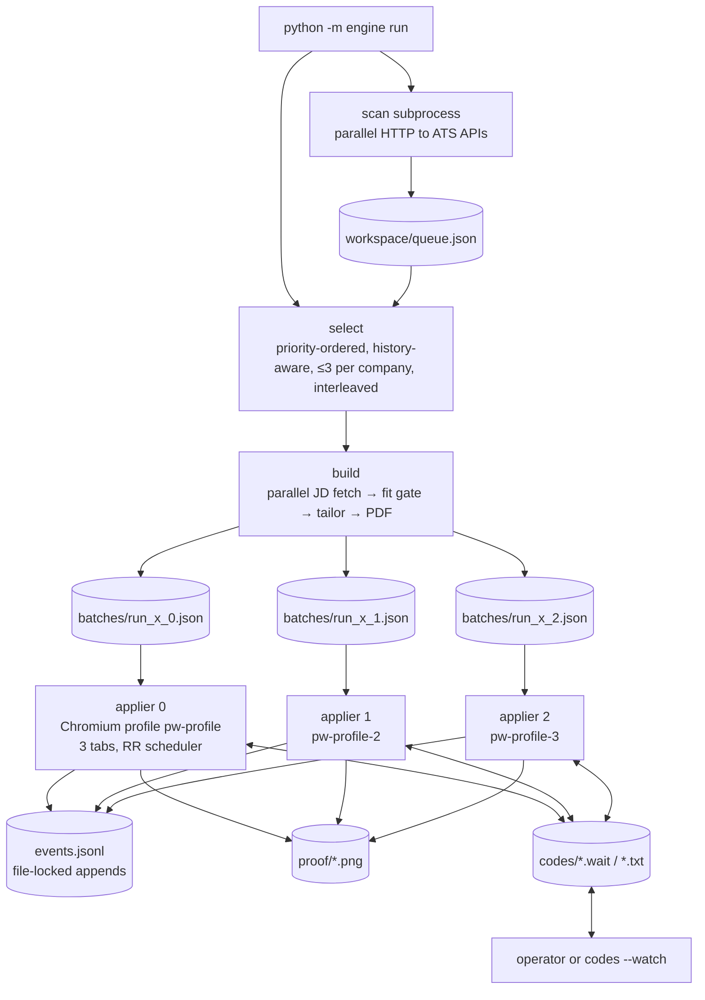

# Architecture

REGEN is a **five-stage pipeline around one append-only event log**. Each stage is a plain Python module with a
library function and a `main()`, so the same code runs from the CLI, the pipeline orchestrator, an MCP tool call or
the API. Stages talk to each other only through files with fixed shapes, which keeps every stage testable alone and
replayable from disk.

## Process model

- **Appliers are separate OS processes**, each with its own persistent Chromium profile, so parallelism comes from
  processes and inside each process from the round-robin scheduler across tabs. Sync Playwright blocks the thread
  while it waits on a page, and measurements show each applier ~95% busy, so the next speed step is more processes
  (or async Playwright).
- **Coordination is file-based**: `queue.json`, batch files, `codes/<board>_<id>.wait|.txt`, `ashby_cooldown`,
  `events.jsonl`. Nothing needs a running daemon, and a crash loses at most the job in flight.

## Module map

| Package | Responsibility | Key files |
|---|---|---|
| `engine/discovery` | Find postings, resolve leads to the source, filter by domain | `ats.py`, `scan.py`, `watch.py`, `alerts.py`, `newgrad.py`, `simplify.py`, `bigtech.py`, `filters.py` |
| `engine/tailoring` | Fit gate, lane routing, composer, validator, PDF, ATS read-back, salary | `tailor.py`, `compose.py`, `resume.py`, `batch.py`, `salary.py` |
| `engine/apply` | ATS adapters, answer resolver, scheduler, drafts, codes, form inspection | `runner.py`, `scheduler.py`, `drafts.py`, `codes.py`, `inspect_form.py` |
| `engine/feedback` | Event log, inbox classification, learning, answers write path | `events.py`, `inbox.py`, `answers.py` |
| `engine/safety.py` | Airbags: sensitive fields, unexpected sites, drift from presets, rate caps, kill switch | |
| `engine/pipeline.py` | `engine run`: discover, select, build, split, spawn appliers, report | |
| `engine/memory` | Knowledge graph over facts, jobs, companies, outcomes | `graph.py`, `schema.cypher` |
| `engine/connectors` | MCP server (stdio) | `mcp_server.py` |
| `apps/api` | FastAPI + Pydantic read API, SSE stream, opt-in write path | |
| `apps/web` | Next.js live view, `/graph`, `/room`, `/room/[stage]`, `/job` | |

## Data contracts

| Artifact | Shape | Written by → read by |
|---|---|---|
| `queue.json` | `[{source, ats, token, id, company, title, location, posted, url}]` | discovery → select/build |
| `batches/<name>.json` | `[{name, url, ats, resume, lane, extra, salary_range}]` | build → apply |
| `specs/<co>_<id>.json` | resume spec: lane, role fact ids, projects, skills, headline, summary | tailor → resume.fit |
| `jd/<ats>_<co>_<id>.json` | raw posting payload | build → fit gate, audits |
| `events.jsonl` | one JSON object per line: `ts`, `kind`, payload | everything → report, API, learn, graph |
| `proof/*.png` | full-page screenshot at the end of every attempt | apply → report (verified-only) |
| `codes/<slug>.wait` / `.txt` / `.tried` | company + form URL / the code / codes already sent | apply ↔ codes |

Event kinds: `discovered`, `resume`, `application`, `schedule`, `outcome`, `pipeline`, `alerts`, `flag`, `answer`,
`published`. An application event carries the status, every question → answer pair, drafted answers with their fact
ids, the resume path and the proof path, which is everything needed to audit one submission.

## Storage and memory

- **Source of truth:** `workspace/events.jsonl` (append-only; cross-process lock on write; incremental reads).
- **Platform store:** Postgres (optional) mirrors events for the API and web app.
- **Knowledge graph:** facts ↔ skills ↔ projects ↔ roles ↔ jobs ↔ companies ↔ outcomes (`engine/memory`),
  queryable from the CLI (`engine graph <term>`), the API (`/api/graph`) and MCP.
- **Personal data** (`profile/`, `workspace/`, `.env`) is git-ignored. CI and a pre-push hook scan for leaks.

## Failure isolation

| Failure | Blast radius |
|---|---|
| One ATS board errors or 404s | That board is marked dead and rechecked later; the scan continues |
| One JD fetch fails | That job is skipped ("posting is gone") |
| One resume can't fit one page | Drop the least relevant project and retry; if still too long, skip that job only |
| One form throws | That job records `ERROR` with the message; the tab is reused for the next job |
| A site bot-checks us | That ATS cools down (Ashby 24 h) or is skipped (`REGEN_SKIP_ATS`); others continue |
| Airbag trips | Job is `FLAGGED` before submit with a screenshot; the batch continues |

Related: [Discovery](Discovery.md) · [Tailoring](Tailoring.md) · [Apply engine](Apply-Engine.md) ·
[Outcomes and learning](Outcomes-and-Learning.md) · [Platform](Platform.md) · [Algorithms](Algorithms.md)

## v0.10 additions
- **Zero cost** ([Zero-Cost-and-MCP](Zero-Cost-and-MCP)): no model keys; the user's own AI client drives the engine over MCP.
- **Trust gate** ([Trust-Gate](Trust-Gate)): ATS-host allowlist + scam red flags, before any data is shared.
- **Priority + history** ([Job-Priority](Job-Priority)): best-fit jobs first; captcha-walled ATSs and user-only blockers skipped; one retry for transient failures; scans merge into the queue; `--loop` first-applicant mode.
- **Control room** ([Control-Room](Control-Room)): start/stop runs, filters, live appliers, every submission with its resume PDF.
