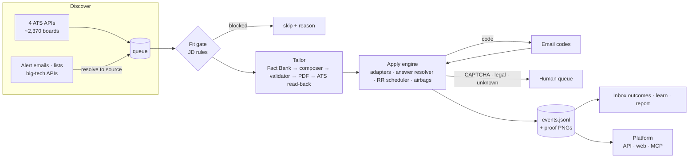

# REGEN: the autonomous job engine

> **Hit the role in its first hour, not its first week, with a resume that can't lie.**

REGEN is an open-source, local-first engine that runs a job search end to end:

- **Finds** roles at the source: it polls ~2,370 company boards on four ATS APIs and resolves alerts, lists and
  careers APIs back to the employer's own posting.
- **Rejects** roles you'd be screened out of before spending any effort on them.
- **Writes** one resume per job from a Fact Bank of claims you can prove.
- **Applies** on the company's own form, in parallel.
- **Proves** every submission with the confirmation page.

It is built like infrastructure: an append-only event log, a preemptive round-robin scheduler, typed APIs, an MCP
server, a privacy gate in CI and 95 tests.

| Verified applications | Boards polled | Biggest day | ATS read-back | Tests |
|---|---|---|---|---|
| **69** (proof on disk) | **~2,370** | **28** (2026-10-09) | **77–100%** | **95** |

## The system in one picture

## Map of the wiki

**Start here**

| Page | Read it for |
|---|---|
| [Ideology](Ideology.md) | The non-negotiables: truthful, transparent, local-first, lean, you-start-it |
| [How it works](How-it-works.md) | A posting's journey from discovery to a verified submission |
| [Architecture](Architecture.md) | Processes, modules, data stores, contracts between stages |
| [Metrics](Metrics.md) | Every number we publish and how to reproduce it |

**Subsystems (deep dives)**

| Page | Read it for |
|---|---|
| [Discovery](Discovery.md) | ATS adapters, board registry, watcher, alert emails, lead resolution, big-tech APIs |
| [Fit gate](Fit-Gate.md) | JD rules that block ineligible roles, and the rejection log that grows them |
| [Tailoring](Tailoring.md) | Fact Bank, lanes, the JD-first composer, validator, one-page fit, ATS read-back |
| [Apply engine](Apply-Engine.md) | Adapters per ATS, the answer resolver, dropdown matching, scheduler, airbags |
| [Email codes](Email-Codes.md) | Greenhouse security codes: matching, freshness, bounced codes, IMAP watch |
| [Outcomes and learning](Outcomes-and-Learning.md) | Event log, inbox classification, verified-only reporting, `learn` |
| [Platform](Platform.md) | FastAPI API, Next.js live view and engine room, MCP server, public site |

**Operating it**

| Page | Read it for |
|---|---|
| [Running the engine](Running.md) | A day's run, step by step |
| [Configuration](Configuration.md) | Profile files, presets, every `REGEN_*` environment variable |
| [Truthfulness and safety](Truthfulness-and-Safety.md) | Validator, presets-only legal answers, airbags, privacy gate |
| [Algorithms and complexity](Algorithms.md) | Scheduler, adaptive quantum, tailoring, matching: costs and measurements |
| [Testing and evidence](Testing.md) | What is tested and how |
| [Decisions](Decisions.md) | Dated design decisions and the reasons for them |
| [Roadmap](Roadmap.md) | What ships next and why |
| [FAQ](FAQ.md) | Short answers |

## Versions

| Version | Theme | Highlights |
|---|---|---|
| v0.1–0.6 | Engine | Discovery, Fact-Bank tailoring, Greenhouse/Ashby apply with proof, airbags, inbox loop, live view, privacy gate |
| v0.7 | Platform | FastAPI + Pydantic API, Postgres event store, Next.js live view, memory graph, MCP server, Lever + Workable |
| v0.8 | Throughput, truthfully | Round-robin scheduler with adaptive quantum, parallel appliers, `engine run`, drafted answers from facts |
| **v0.9 / 0.9.1** | Composer, fewer stops | JD-first composer + ATS read-back, engine room, big-tech discovery, code matcher, `codes --watch`, rule fixes from live runs |

Every page here lives in `docs/wiki/` and is reviewed in pull requests like code.
