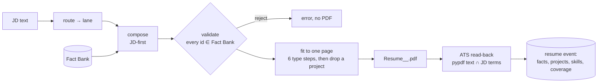

# Tailoring

**Thesis:** a tailored resume should change *selection and order*, never *content*. Every line on every resume
comes from a Fact Bank entry the user wrote and can defend in an interview. The composer decides which facts to use
and in what order. It can't invent a claim.

## Inputs

| File | Contents |
|---|---|
| `profile/fact_bank.json` | `facts` (id → sentence), `roles` (company, title, location, dates, fact ids), `projects`, `skills` lines, `education`, `_sources`, `_overlaps` |
| `profile/lanes.json` | resume **lanes** (backend, platform, fullstack, ai, data, embedded, sre, ...): headline, summary opener, ordered fact ids, projects, skills order; routing rules title/JD → lane |
| the JD | fetched per job, HTML-unescaped |

## Pipeline

### Routing
Lane rules are regexes over title, and then the JD, scoped per rule. The first match wins, then the default lane.
Lanes encode the user's real tracks; they are not personas.

### JD-first composer (`engine/tailoring/compose.py`)
- **Vocabulary:** the JD's terms ∩ the Fact Bank's skill vocabulary, counted by frequency and spelled as the JD
  spells them (for example "PostgreSQL" vs "Postgres").
- **Headline:** the role title + the three skill items the posting mentions most.
- **Summary:** the lane opener + the best-matching sentences the user wrote, kept in one voice.
- **Skills lines:** reordered so the JD's terms come first; nothing is added that isn't in the Fact Bank.
- **Roles and projects:** fact ids ranked by JD-term overlap within each role; projects titled per lane.
- **Overlap groups:** facts that describe the same achievement in different words never appear twice.

### Validator (`resume.validate`)
Rejects any spec that references a fact, project or skill id that isn't in the Fact Bank. This check is the
guarantee that the composer can't fabricate.

### One-page fit (`resume.fit`)
Six leading/size steps (11.6/9.3 → 10.0/8.8). If it still runs to two pages, drop the least relevant (last)
project and retry, recursively. If it still doesn't fit, the job is skipped (the batch continues).

### ATS read-back (`compose.ats_check`)
The PDF is parsed back with `pypdf` and the score is the share of the JD terms you have that a parser can actually
read. Live runs score **77–100%**, typically high 80s to 100. The score is logged per resume, and the engine room
shows it per job.

## Transparency

Each `resume` event records the lane, the role fact ids, projects, skills and coverage
(`on_resume`, `jd_terms_you_have`, `ats.score`). `/job?u=<url>` in the web app shows exactly which facts a given
application used.

## Cost

Routing O(R) regexes; composing O(F·T) for F facts and T JD terms; PDF build ~tens of ms; read-back one parse.
Tailoring was made ×3 faster in v0.8 (precompiled vocab, single pass), so it costs little next to a page load.

Related: [Fit gate](Fit-Gate.md) · [Apply engine](Apply-Engine.md) · [Truthfulness and safety](Truthfulness-and-Safety.md) ·
[Algorithms](Algorithms.md)
