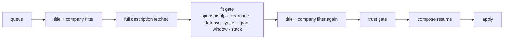

# Trust gate: no data until the employer is real

Job scams copy real postings, live on look-alike domains and ask for money, bank details or chat-app interviews.
REGEN treats every posting as untrusted until it passes `engine/discovery/trust.py`, and **no personal data is
typed anywhere that hasn't**.

## The three checks
| Check | Rule | Why |
|---|---|---|
| Host | the application URL must be an applicant-tracking system the employer controls (Greenhouse, Lever, Ashby, Workable, Workday, iCIMS, SmartRecruiters, ...). Shorteners, form builders, free web hosts and chat apps are never auto-filled. | an employer's own ATS board is tied to its account; a Google Form or a link shortener is not |
| Description red flags | up-front fees, "we'll send you a check for equipment", interviews over Telegram/WhatsApp/Signal, crypto/gift-card pay, early SSN/bank requests, "no experience, $50/hr", reshipping | these phrases come from published job-scam advisories |
| Contact | "email your resume to <a free-mail address>" style postings | real employers apply through their ATS or corporate domain |

The inbox loop runs the same detector on recruiter email (`message_flags`): a free-mail "recruiter" talking about
offers or interviews, or any money / identity / chat-app ask, is classified **scam**, never answered, and surfaced
to you.

## Where it runs

Every stage re-checks: titles change between sources, so the filter runs again after the description is read, and
`--force` (which keeps jobs with fit-gate blockers for review) **cannot** override the trust gate.

## Evidence
- `tests/test_core.py::test_trust_gate`: ATS host passes; shortener fails; chat-app interview + equipment check
  fails; free-mail recruiter asking for an SSN is flagged; a normal confirmation is not.
- `tests/test_core.py::test_slug_company_exclusion`, `test_defense_jd_blocked`: excluded employers match whether
  the ATS slug has spaces or not; defense descriptions are blocked.
