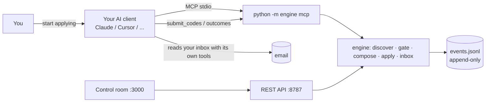

# Zero cost: your AI runs the engine

REGEN has **no paid API keys and no hosted model**. The intelligence comes from the AI client you already use
(Claude Desktop / Claude Code, Cursor, any MCP-capable assistant), connected to the engine over the
[Model Context Protocol](https://modelcontextprotocol.io). The engine is the hands; your assistant is the head.

## Why this design
| Concern | Hosted-LLM design | REGEN |
|---|---|---|
| Cost | per-token bills, API keys to manage | $0: uses the assistant you already pay for or run locally |
| Secrets | keys in `.env`, rotation, leaks | no model keys exist to leak |
| Privacy | resume + answers sent to a third-party API | data stays on disk; the assistant sees only what a tool returns |
| Truth | model can invent experience | writing is template + Fact Bank only (see [Tailoring](Tailoring)); the assistant orchestrates, it doesn't author claims |

## What the assistant can call
Read tools are always on; write tools need `REGEN_MCP_WRITE=1` on your machine.

| Tool | Kind | What it does |
|---|---|---|
| `engine_status` | read | verified counts (proof on disk), waiting items, boards watched, outcomes |
| `applications` | read | applications by status, newest first |
| `human_queue` | read | only what a human must do (legal attestations, captcha walls) |
| `outcomes` | read | classified replies: confirmation, rejection, OA, interview, offer, scam |
| `memory_query` | read | knowledge-graph neighborhood of a company, fact id or lane |
| `job_queue` | read | discovered jobs waiting, filterable |
| `pipeline_status` | read | each applier's latest results and jobs waiting for an email code |
| `pipeline_run` | write | start discover → gate → compose → apply in the background |
| `submit_codes` | write | deliver email security codes the assistant read from the inbox |

The same operations exist in the CLI (`python -m engine ...`) and the control room, so nothing depends on any one
assistant.

## Evidence
- `engine/connectors/mcp_server.py`: the tool definitions above.
- `tests/test_api.py`: API parity for the read surface.
- No model SDK appears in `requirements.txt`; `grep -ri "api_key" engine/` finds none.
